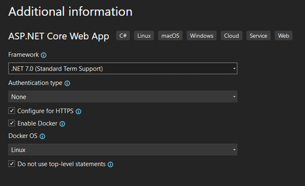

# What are ASP.NET Razor Pages

## How Razor Pages work


ASP.Net Routing receives the request from the browser to show which Razor Page to trigger (Welcome).

It is going to use the ASP.Net View Engine to locate and render the view so the user can see the result.

When you call the Welcome page Razor Pages is going to search the **Pages/Home** folder for the ``Welcome.cshtml`` and ``Welcome.cshtml.cs`` files. ``Welcome.cshtml.cs`` is the code behind file which is where all of the logic is placed.

## Razor Page code

A simple Razor Page code file looks like this.

```csharp
    public class HomeModel : PageModel
    {
        public void OnGet()
        {

        }
    }
```

The name of the class must end with **Model**. In our case ``HomeModel``. We inherit from the ``PageModel`` class.

Razor pages have the following features.

* Everything under the Pages folder is important. This is where all of our pages reside.
* Razor pages are designed for page-focused scenarios.
* Anti-forgery token validation is enabled automatically.
* Hard to create complex routes.

## Creating a new project

Select ASP.Net core web app (search for web app).


Add an project name, location and solution name.

In the next page select the version of **.Net** you want to use.



Select Authentication if you want to use it.

Check Configure for HTTPS.

Enable Docker if you want to use Docker (use Linux format).

You now have a project with the following format.


**wwwroot** is where all static content gets added. It has **css**, **js** and **lib** folders which have their specific files. The **lib** file contains the Bootstrap and jQuery files. **css** is where you add site specific .css files. **js** contains the JavaScript files that you write.

You can also create an images folder here for your site images.

The most important folder is the **Pages** folder and this contains the following.


This is where all of your pages reside. It already has some basic pages.

You have the following pages.

* Index.cshtml
* Error.cshtml
* Privacy.cshtml

Under each of these pages you have a **.cshtml.cs** code  file.

Also in the **Pages** folder we have two other files.

1. **_ViewImports.cshtml** 

Which contains the namespaces and Using statements we want to use throughout the app.

```cshtml
    @using MoviesApp
    @namespace MoviesApp.Pages
    @addTagHelper *, Microsoft.AspNetCore.Mvc.TagHelpers
```

2. **_ViewStart**

Shows us where the Layout page is for all of our pages.

```cshtml
    @{
        Layout = "_Layout";
    }
```

This tells us our layout page is **_Layout.cshtml**.

The Layout page is in the **Shared** folder

1. **_Layout.cshtml**

This contains the formatting for each of our Razor Pages including the navigation bar.

```cshtml
    <div class="container">
        <main role="main" class="pb-3">
            @RenderBody()
        </main>
    </div>
```

The most important part of this page being, ``@RenderBody()`` and this is where our individual page content is injected.

Also the ``_Layout.cshtml`` page contains a code behind page named ``_layout.cshtml.css`` file that contains our site styling.

2. **_ValidationScriptsPartial.cshtml**

This contains a list of scripts that we include in our site.

```cshtml
<script src="~/lib/jquery-validation/dist/jquery.validate.min.js"></script>
<script src="~/lib/jquery-validation-unobtrusive/jquery.validate.unobtrusive.min.js"></script>
```

In the root folder there are a couple of other important files.

1. **appsettings.json**

```json
    {
      "Logging": {
        "LogLevel": {
          "Default": "Information",
          "Microsoft.AspNetCore": "Warning"
        }
      },
      "AllowedHosts": "*"
    }
```

This is where we add the connection string settings and app secrets settings, etc.

2. **Program.cs**

Is the most important file in our project because the application starts from this file.

```csharp
namespace MoviesApp
{
    public class Program
    {
        public static void Main(string[] args)
        {
            var builder = WebApplication.CreateBuilder(args);

            // Add services to the container.
            builder.Services.AddRazorPages();

            var app = builder.Build();

            // Configure the HTTP request pipeline.
            if (!app.Environment.IsDevelopment())
            {
                app.UseExceptionHandler("/Error");
                // The default HSTS value is 30 days. You may want to change this for production scenarios, see https://aka.ms/aspnetcore-hsts.
                app.UseHsts();
            }

            app.UseHttpsRedirection();
            app.UseStaticFiles();

            app.UseRouting();

            app.UseAuthorization();

            app.MapRazorPages();

            app.Run();
        }
    }
}
```

We can add services to our application in this section. You can see that we are running the Razor Pages service.

```csharp
    // Add services to the container.
    builder.Services.AddRazorPages();
```

You can configure HTTPS for production.

```csharp
    // Configure the HTTP request pipeline.
    if (!app.Environment.IsDevelopment())
    {
        app.UseExceptionHandler("/Error");
        // The default HSTS value is 30 days. You may want to change this for production scenarios, see https://akms/aspnetcore-hsts.
        app.UseHsts();
    }
```

We can request the HTTP requests are sent to HTTPS with.

```csharp
    app.UseHttpsRedirection();
```

We can serve static content (images, css, etc) in our project with.

```csharp
    app.UseStaticFiles();
```

To use routing.

```csharp
    app.UseRouting();
```

This allows the page to be served from within the pages folder.

We allow Razor Pages to be served with.

```csharp
    app.MapRazorPages();
```

This is used to configure the end-point routing for the Razor Pages.

The last line runs our application.

```csharp
    app.Run();
```

## Razor Pages Key Concepts

Razor Pages (or content pages) are intended to be browsable and contain a mixture of client-side and server-side code.

Razor Pages are decorated with the ``@page`` directive. This specifies that it's a Razor page.

For each page we also have a ``@model`` directive that specifies the model used on the page.

We also have Razor page code blocks encased in ``@{ ... }``. This is where you can write your C# code.

To pass data from a page to a model we are going to use ``model binding``.
