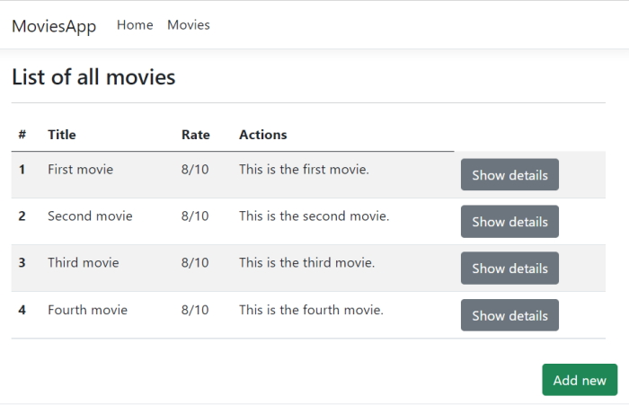
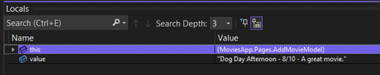
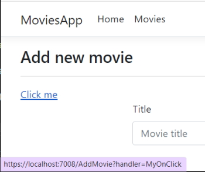
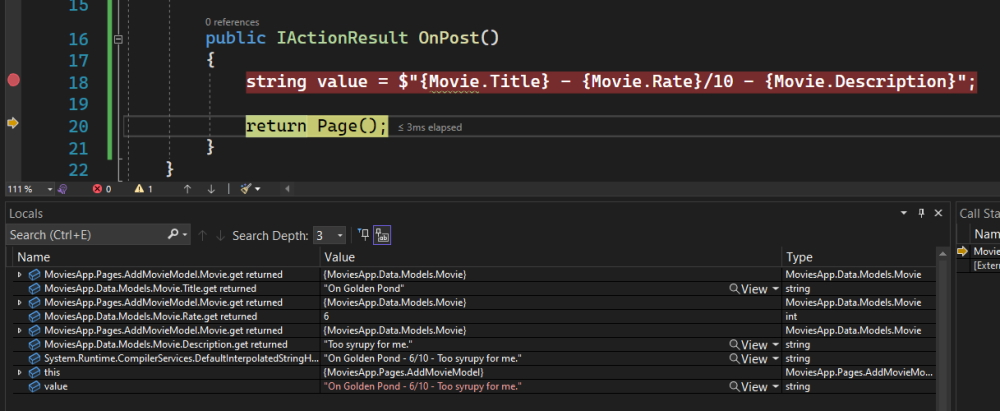
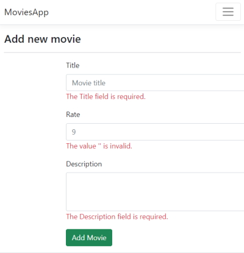
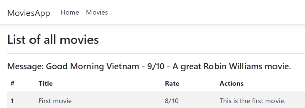

# Working with Forms in Razor Pages

Code: ``Sandbox\Razor\MovieApp``

**Note:** in these ode example we are not going to use ``scaffolding`` to build our pages. All the HTML and code will be added manually.

## One way data binding

The following file has hard coded data. We are going to change this with one way data binding.

### Movies.cshtml

```csharp
    @page
    @model MoviesApp.Pages.MoviesModel
    @{
        ViewData["Title"] = "List of all movies";
    }

    <h3>@ViewData["Title"]</h3>
    <hr />

    <table class="table table-striped">
        <thead>
            <tr>
                <th scope="col">#</th>
                <th scope="col">Title</th>
                <th scope="col">Rate</th>
                <th scope="col">Actions</th>
            </tr>
        </thead>
        <tbody>
            <tr>
                <th scope="row">1</th>
                <td>Mark is example movie title</td>
                <td>9/10</td>
                <td><a href="/Movie/6" class="btn btn-secondary">Show details</a></td>
            </tr>
            <tr>
                ...
            </tr>

        </tbody>
    </table>

    <div style="position: fixed; bottom: 70px;right:25px;">
        <a href="/AddMovie" class="btn btn-success">Add new</a>
    </div>
```

Create the folders ``Data/Models``.

Create a class named ``Movie``.

### Movie.cs

```csharp
    namespace MoviesApp.Data.Models
    {
        public class Movie
        {
            public int Id { get; set; }

            public string? Title { get; set; }

            public int Rate { get; set; }

            public string? Description { get; set; }
        }
    }
```

In the ``Movies.cshtml.cs`` model we will add the data binding.

We create a list of movies.

```csharp
    public List<Movie> Movies { get; set; }
```

This will give you an error so we have to add the following ``using`` statement.

```csharp
    using MoviesApp.Data.Models;
```

**Note:** you have to make the ``List<Movie>`` ``public`` so that it can be see in the view.

When you want to send data from the ``Model`` to the ``View`` you need to use the ``OnGet()`` method.

When you want to get data from the ``View`` to the ``Model`` you have to use the ``OnPost()`` method.

In ``OnGet()`` create a list of Movies.

### Movies.cshtml.cs 

```csharp
    using Microsoft.AspNetCore.Mvc;
    using Microsoft.AspNetCore.Mvc.RazorPages;
    using MoviesApp.Data.Models;

    namespace MoviesApp.Pages
    {
        public class MoviesModel : PageModel
        {
            public List<Movie> Movies { get; set; }

            public void OnGet()
            {
                Movies = new List<Movie>()
                {
                    new Movie()
                    {
                        Id = 1,
                        Title = "First movie",
                        Rate = 8,
                        Description = "This is the first movie."
                    },
                    new Movie()
                    {
                        Id = 2,
                        Title = "Second movie",
                        Rate = 8,
                        Description = "This is the second movie."
                    },
                    new Movie()
                    {
                        Id = 3,
                        Title = "Third movie",
                        Rate = 8,
                        Description = "This is the third movie."
                    },
                    new Movie()
                    {
                        Id = 4,
                        Title = "Fourth movie",
                        Rate = 8,
                        Description = "This is the fourth movie."
                    }
                };
            }
        }
    }
```

Now, we need to take out the hard coded data in ``Movies.cshtml`` and replace it with the one way model binding from the Model.

### Movies.cshtml

```csharp
    @page
    @model MoviesApp.Pages.MoviesModel

    @{
        ViewData["Title"] = "List of all movies";
    }

    <h3>@ViewData["Title"]</h3>
    <hr />

    <table class="table table-striped">
        <thead>
            <tr>
                <th scope="col">#</th>
                <th scope="col">Title</th>
                <th scope="col">Rate</th>
                <th scope="col">Actions</th>
            </tr>
        </thead>
        <tbody>

            @foreach (var movie in Model.Movies)
            {
                <tr>
                    <th scope="row">@movie.Id</th>
                    <td>@movie.Title</td>
                    <td>@movie.Rate/10</td>
                    <td>@movie.Description</td>
                    <td><a href="/Movie/@movie.Id" class="btn btn-secondary">Show details</a></td>
                </tr>
            }

        </tbody>
    </table>

    <div style="position: fixed; bottom: 70px;right:25px;">
        <a href="/AddMovie" class="btn btn-success">Add new</a>
    </div>
```

When we run the program we get the following result.



## Two way data binding

Forms use two way data binding. We will build the Add Movie page so we can add data to a form and get data from a form.

The form will use the ``OnPost()`` method to data from the Razor Form (``View``).

In our ``PageModel`` we are going to use properties to gather our data.

### AddMovie.cshtml.cs

```csharp
    using Microsoft.AspNetCore.Mvc;
    using Microsoft.AspNetCore.Mvc.RazorPages;

    namespace MoviesApp.Pages
    {
        public class AddMovieModel : PageModel
        {
            public string? Title { get; set; }

            public int Rate { get; set; }

            public string? Description { get; set; }

            public void OnGet()
            {
                Title = "My new movie";
            }
        }
    }
```

In our code we can initialise data with the ``OnGet()`` method. In our case we could create a new ``Title``.

Now we will add the model to our AddMovie.cshtml view.

### AddMovie.cshtml

```csharp
    @page
    @model MoviesApp.Pages.AddMovieModel
    @{
        ViewData["Title"] = "Add new movie";
    }

    <h3>@ViewData["Title"]</h3>
    <hr />

    <div class="row">
        <div class="col-md-6 offset-3">
            <form method="post">
                <div class="mb-3">
                    <label for="title" class="form-label">Title</label>
                    <input name="Title" type="text" class="form-control" id="title" placeholder="Movie title">
                </div>
                <div class="mb-3">
                    <label for="rate" class="form-label">Rate</label>
                    <input name="Rate" type="number" min="1" max="10" class="form-control" id="rate" placeholder="9">
                </div>
                <div class="mb-3">
                    <label for="description" class="form-label">Description</label>
                    <textarea name="Description" class="form-control" id="description" rows="3"></textarea>
                </div>

                <button type="submit" class="btn btn-success">Add Movie</button>
            </form>
        </div>
    </div>
```

We have added ``name`` values to each field. These relate to our properties in the model.

**Note:** we have to change the form to accept a ``post`` method.

```html
    <form method="post">
        ```

Go back to the ``PageModel`` and we need to add an ``OnPost()`` method to receive a request.

```csharp
    public IActionResult OnPost()
    {
        string value = $"{Title} - {Rate}/10 - {Description}";

        return Page();
    }
```

Add a break point on the ``return Page();`` statement and debug the code.

When we hit the return page statement we hover over the ``value`` variable and we see that there is no data present.

The reason is that when we use this method we can only send data to the view. If we want these properties to be bi-directional we have to use **binding**.

To do this we have to use a decorator named ``BindProperty`` on each of our fields.

### AddMovie.cshtml.cs

```csharp
    using Microsoft.AspNetCore.Mvc;
    using Microsoft.AspNetCore.Mvc.RazorPages;

    namespace MoviesApp.Pages
    {
        public class AddMovieModel : PageModel
        {
            [BindProperty]
            public string? Title { get; set; }

            [BindProperty]
            public int Rate { get; set; }

            [BindProperty]
            public string? Description { get; set; }

            public void OnGet()
            {
                Title = "My new movie";
            }

            public IActionResult OnPost()
            {
                string value = $"{Title} - {Rate}/10 - {Description}";

                return Page();
            }
        }
    }
```

Debug the code again and this time when you over over the variable, ``value`` you will see.



So if you want variable to persist from the ``View`` to the ``PageModel`` you will have to use binding.

## Event binding

Add a page handler to the AddMovie Razor page. This allows us to bind on user events.

```html
    <h3>@ViewData["Title"]</h3>
    <hr />

    <a asp-page-handler="MyOnClick"> Click me</a>

    <div class="row">
        ```

On the PageModel add a new method.

```csharp
    public void OnGetMyOnClick()
    {
        string stopHere = string.Empty;
    }
```

Add a breakpoint on the ``stopHere`` statement and start debugging. Once you hover over the ``Click me`` link you will see the link below.



When you click the link you can see that you are transported to the page handler method, ``OnGetMyOnClick()`` so everything is working as anticipated.

## Model Binding in ASP.Net Razor pages

The way we used binding in the previous example isn't sustainable. Suppose we had 30 properties then it would be hard to manage. This is where model binding is a better option.

Add a ``Movie`` model to the ``PageModel``.

```csharp
    using Microsoft.AspNetCore.Mvc;
    using Microsoft.AspNetCore.Mvc.RazorPages;
    using MoviesApp.Data.Models;

    namespace MoviesApp.Pages
    {
        public class AddMovieModel : PageModel
        {
            public Movie? Movie { get; set; }

            public void OnGet()
            {
            }

            public IActionResult OnPost()
            {
                string value = $"{Title} - {Rate}/10 - {Description}";

                return Page();
            }
        }
    }
```

**Note:** you have to add the following ``using`` reference.

```csharp
    using MoviesApp.Data.Models;
```

This allows you to use the ``Movie`` model.

On the ``AddModel.cshtml`` Razor page change the fields to reflect the Model.

```html
    <form method="post">
        <div class="mb-3">
            <label for="title" class="form-label">Title</label>
            <input name="Movie.Title" type="text" class="form-control" id="title" placeholder="Movie title">
        </div>
        <div class="mb-3">
            <label for="rate" class="form-label">Rate</label>
            <input name="Movie.Rate" type="number" min="1" max="10" class="form-control" id="rate" placeholder="9">
        </div>
        <div class="mb-3">
            <label for="description" class="form-label">Description</label>
            <textarea name="Movie.Description" class="form-control" id="description" rows="3"></textarea>
        </div>

        <button type="submit" class="btn btn-success">Add Movie</button>
    </form>
```

Now change the PageModel ``OnPost()`` method.

```csharp
    public IActionResult OnPost()
    {
        string value = $"{Movie.Title} - {Movie.Rate}/10 - {Movie.Description}";
        return Page();
    }
```

And add a breakpoint on the value statement and debug.

When you hover over ``value`` you get a null value. All of the Movie values get a null exception because once again you need to bind to the ``Movie`` model.

Add.

```csharp
    [BindProperty]
    public Movie? Movie { get; set; }
```

And debug again.



## Form validation

When working with forms it is important that you validate the form data before you store it in a database.

In our example you will learn how to validate on the back end and show any errors on the front end.

You need to add a validation message on every form field.

In ``AddMovie.cshtml``.

```html
    <form method="post">
        <div class="mb-3">
            <label for="title" class="form-label">Title</label>
            <input name="Movie.Title" type="text" class="form-control" id="title" placeholder="Movie title">
            <span asp-validation-for="@Model.Movie.Title" class="text-danger"></span>
        </div>
        <div class="mb-3">
            <label for="rate" class="form-label">Rate</label>
            <input name="Movie.Rate" type="number" min="1" max="10" class="form-control" id="rate" placeholder="9">
            <span asp-validation-for="@Model.Movie.Rate" class="text-danger"></span>
        </div>
        <div class="mb-3">
            <label for="description" class="form-label">Description</label>
            <textarea name="Movie.Description" class="form-control" id="description" rows="3"></textarea>
            <span asp-validation-for="@Model.Movie.Description" class="text-danger"></span>
        </div>

        <button type="submit" class="btn btn-success">Add Movie</button>
    </form>
```

We will change the ``Movie`` model.

### Data/Models/Movie.cs

```csharp
    using System.ComponentModel.DataAnnotations;

    namespace MoviesApp.Data.Models
    {
        public class Movie
        {
            public int Id { get; set; }

            [Required, StringLength(50)]
            public string? Title { get; set; }

            [Required]
            public int Rate { get; set; }

            [Required, StringLength(50)]
            public string? Description { get; set; }
        }
    }
```

In the ``PageModel``.

```csharp
    public IActionResult OnPost()
    {
         string value = $"{Movie.Title} - {Movie.Rate}/10 - {Movie.Description}";

         if (!ModelState.IsValid)
         {
             return Page();
         }

         return Redirect("Movies");
    }
```

Once again, add a breakpoint on the ``if()`` statement and debug.

If we don't add any values into the fields and click the ``Add Movie`` button the validation fails and we return the current page with the following errors.



Add some valid input into each of the fields and this time once you pass validation you will be returned to the ``Movies`` page.

We could also use ``TempData`` to pass the data once validated to the ``Movies`` page. At present we are not adding the new Movie to the Movies list so for a temporary solution we could use the ``[TempData]`` annotation.

### AddMovie.csharp.cs

```csharp
    using Microsoft.AspNetCore.Mvc;
    using Microsoft.AspNetCore.Mvc.RazorPages;
    using MoviesApp.Data.Models;

    namespace MoviesApp.Pages
    {
        public class AddMovieModel : PageModel
        {
            [BindProperty]
            public Movie? Movie { get; set; }

            [TempData]
            public string Message { get; set; }

            public void OnGet()
            {
            }

            public IActionResult OnPost()
            {
                string value = $"{Movie.Title} - {Movie.Rate}/10 - {Movie.Description}";

                if (!ModelState.IsValid)
                {
                    return Page();
                }

                Message = value;

                return Redirect("Movies");
            }
        }
    }
```

This creates a ``Message`` property and we store the results of ``value`` if the ``ModelState`` is valid.

Add a ``Message`` field on the Movies.cshtml Razor page.

```csharp
    <h3>@ViewData["Title"]</h3>
    <hr />

    <h5>Message: @Model.Message</h5>

    <table class="table table-striped">
```

In the ``Movies`` PageModel add the ``Message`` property.

```csharp
    public List<Movie>? Movies { get; set; }

    [TempData]
    public string Message { get; set; }
```

Once you have added valid data in the AddMovie page you will see the following message appear on the ``Movies`` Razor page.



### Conclusion

We have seen that there are three ways of Data Binding.

1. One way binding
2. Two way binding
3. Event binding
