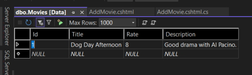
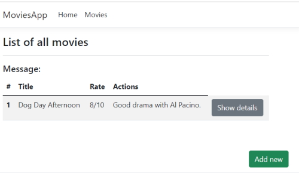
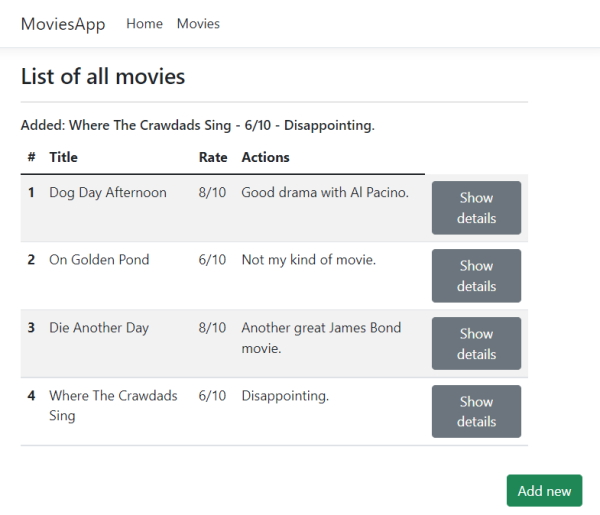

# Working with Data in Razor Pages

Code: ``Sandbox\Razor\MovieApp``

## Adding Entity Framework

### Steps

1. Create new database
2. Get connection string
3. Configure Entity Framework Core

### NuGet packages

* Microsoft.EntityFrameworkCore
* Microsoft.EntityFrameworkCore.SqlServer
* Microsoft.EntityFrameworkCore.Tools

### Create SQL Server database

In Visual Studio go to ``Server Explorer`` and add a new database. It will ask for the Server name (``TIGER``) and we want to use *Windows Authentication*.

In *Connect to a database* name it ``MovieApp``.

Click ``Ok``.

In the Server Explorer data connection you will see.

```bash
    tiger.MovieApp.dbo
```

Right-Click the ``MovieApp`` database and look at *Properties* you will see a *Connection string* so copy this.

To store the connection string use the ``appsettings.json`` file.

```json
    {
      "Logging": {
        "LogLevel": {
          "Default": "Information",
          "Microsoft.AspNetCore": "Warning"
        }
      },
      "AllowedHosts": "*",
      "ConnectionStrings": {
        "MovieApp": "Data Source=TIGER;Initial Catalog=MovieApp;Integrated Security=True"
      }
    }
```

**Note:** you can add multiple connection strings in here, each separated by a comma.

### Add NuGet packages

Open the NuGet console.

```powershell
    Install-Package Microsoft.EntityFrameworkCore
    
    Install-Package Microsoft.EntityFrameworkCore.SqlServer

    Install-Package Microsoft.EntityFrameworkCore.Tools
```

### Create the DbContext

In the ``Data`` folder create a new class named ``MovieAppDbContext.cs``. This class is going to serve as the translator between the SQL and our entities.

In the class we need to inherit from the base class ``DbContext``.

Add the using statement ``using Microsoft.EntityFrameworkCore;``.

Create a ``ctor`` constructor named ``MovieAppDbContext()``.

```csharp
    using Microsoft.EntityFrameworkCore;
    using MoviesApp.Data.Models;

    namespace MoviesApp.Data
    {
        public class MovieAppDbContext: DbContext
        {
            public MovieAppDbContext(DbContextOptions<MovieAppDbContext> options): base(options)
            {

            }

            public DbSet<Movie> Movies { get; set; }
        }
    }
```

We have injected the ``DbContextOptions`` into our constructor and we need to add C# class ``MovieAppDbContext`` and name it ``options`` which inherits from ``base(options)``.

We also need to create a ``DbSet<>`` and this will be used by Entity Framework Core to create the table in our database which will be derived from our ``Movie`` model. We import the Namespace from Movie (``MoviesApp.Data.Models``). The table name will be ``Movies`` and we need to ``get`` and ``set`` data to and from the database.

Now we need to configure our context to be able to work with the Entity Framework Core and the SQL Server database. To do this we need to go to the ``Program.cs`` class file and add the following statement below the ``AddRazorPages()`` statement.

```csharp
    builder.Services.AddDbContext<MovieAppDbContext>(options => 
        options.UseSqlServer(builder.Configuration.GetConnectionString("MovieApp")));
```

We add a ``builder.Services.AddDbContext`` and use the ``MovieAppDbContext`` context. In our options we need to tell the services that we are using ``SqlServer``. To access our connection string we use ``builder.Configuration.GetConnectionString`` to get the configuration string with our reference to the ``MovieApp`` connection string from ``appsettings.json``.

### Adding a migration

This will build the database for us using Entity Framework Core and SQL Server.

**Note:** before you run the following you should compile your project and make sure you have no compile errors.

Go to the NuGet console.

```powershell
    Add-Migration Initial
```

Where ``Initial`` is the name of the migration.

This creates the database.

If you look in the migrations folder you will see ``20220720063743_Initial.cs`` which is the script to create the table in our database. To do this run the following NuGet command.

```powershell
    Update-Database
```

This creates the ``Movie`` table.

In the Server Explorer in Visual Studio go to the database and open the tables. You will see the ``Movie`` table. From here you can ``Show Table Data`` to see if there is any table rows. In our case there won't be.

## Adding and storing data in a database

We are going to add a new ``Movie`` into the database.

In our ``AddMovie`` PageModel we need to create a constructor and add our database context.

```csharp
    private MovieAppDbContext _context;

    public AddMovieModel(MovieAppDbContext context)
    {
        _context = context;
    }
```

Now, in our ``OnPost()`` method we create a new ``Movie`` object to save the data that has been posted.

```csharp
    public IActionResult OnPost()
    {
        string value = $"{Movie.Title} - {Movie.Rate}/10 - {Movie.Description}";
        
        if (!ModelState.IsValid)
        {
            return Page();
        }

        Message = value;
        
        var movie = new Movie()
        {
            Title = Movie.Title,
            Rate = Movie.Rate,
            Description = Movie.Description
        };
        
        _context.Movies.Add(movie);
        _context.SaveChanges();
        
        return Redirect("Movies");
    }
```

Once we have added our data to our ``Movie`` object add it to the context, ``_context.Movies.Add(movie)`` and save the changes to the database with ``_context.SaveChanges()``.

We can now use server explorer to view our ``Movie`` table and we see that it has saved a record.



We are then redirected to the ``Movies`` page. We don't see the new ``Movie`` object on the page because the data is hardcoded. That will be our next task.

## Getting data from a database

To be able to see the data in our ``Movies`` list go to ``Movies.cshtml.cs``. Remove the hardcoded data from the ``OnGet()`` method. 

### Movies.cshtml.cs

```csharp
    using Microsoft.AspNetCore.Mvc;
    using Microsoft.AspNetCore.Mvc.RazorPages;
    using MoviesApp.Data;
    using MoviesApp.Data.Models;

    namespace MoviesApp.Pages
    {
        public class MoviesModel : PageModel
        {
            public List<Movie>? Movies { get; set; }

            [TempData]
            public string Message { get; set; }

            private MovieAppDbContext _context;

            public MoviesModel(MovieAppDbContext context)
            {
                _context = context;
            }

            public void OnGet()
            {
                Movies = _context.Movies.ToList();
            }
        }
    }
```

We add a constructor to get the context and then use ``_context.Movies.ToList()`` to pass back a list of ``Movies``.

Now run the application again and we will see that there is one Movie in our ``Movies`` Razor page.



Add some more movies to see them in the list.



## Getting data by ID from the database
