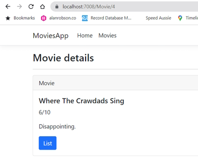

# Working with Data in Razor Pages

Code: ``Sandbox\Razor\MovieApp``

**Note:** in these code examples we are not going to use ``scaffolding`` to build our pages. All the HTML and code will be added manually.

## Adding Entity Framework

### Steps

1. Create new database
2. Get connection string
3. Configure Entity Framework Core

### NuGet packages

* Microsoft.EntityFrameworkCore
* Microsoft.EntityFrameworkCore.SqlServer
* Microsoft.EntityFrameworkCore.Tools

### Create SQL Server database

In Visual Studio go to ``Server Explorer`` and add a new database. It will ask for the Server name (``TIGER``) and we want to use *Windows Authentication*.

In *Connect to a database* name it ``MovieApp``.

Click ``Ok``.

In the Server Explorer data connection you will see.

```bash
    tiger.MovieApp.dbo
```

Right-Click the ``MovieApp`` database and look at *Properties* you will see a *Connection string* so copy this.

To store the connection string use the ``appsettings.json`` file.

```json
    {
      "Logging": {
        "LogLevel": {
          "Default": "Information",
          "Microsoft.AspNetCore": "Warning"
        }
      },
      "AllowedHosts": "*",
      "ConnectionStrings": {
        "MovieApp": "Data Source=TIGER;Initial Catalog=MovieApp;Integrated Security=True"
      }
    }
```

**Note:** you can add multiple connection strings in here, each separated by a comma.

### Add NuGet packages

Open the NuGet console.

```powershell
    Install-Package Microsoft.EntityFrameworkCore
    
    Install-Package Microsoft.EntityFrameworkCore.SqlServer

    Install-Package Microsoft.EntityFrameworkCore.Tools
```

### Create the DbContext

In the ``Data`` folder create a new class named ``MovieAppDbContext.cs``. This class is going to serve as the translator between the SQL and our entities.

In the class we need to inherit from the base class ``DbContext``.

Add the using statement ``using Microsoft.EntityFrameworkCore;``.

Create a ``ctor`` constructor named ``MovieAppDbContext()``.

```csharp
    using Microsoft.EntityFrameworkCore;
    using MoviesApp.Data.Models;

    namespace MoviesApp.Data
    {
        public class MovieAppDbContext: DbContext
        {
            public MovieAppDbContext(DbContextOptions<MovieAppDbContext> options): base(options)
            {

            }

            public DbSet<Movie> Movies { get; set; }
        }
    }
```

**Note:** don't forget to make ``DbSet<Movie> Movies { get; set; }`` **public**.

We have injected the ``DbContextOptions`` into our constructor and we need to add C# class ``MovieAppDbContext`` and name it ``options`` which inherits from ``base(options)``.

We also need to create a ``DbSet<>`` and this will be used by Entity Framework Core to create the table in our database which will be derived from our ``Movie`` model. We import the Namespace from Movie (``MoviesApp.Data.Models``). The table name will be ``Movies`` and we need to ``get`` and ``set`` data to and from the database.

Now we need to configure our context to be able to work with the Entity Framework Core and the SQL Server database. To do this we need to go to the ``Program.cs`` class file and add the following statement below the ``AddRazorPages()`` statement.

```csharp
    builder.Services.AddDbContext<MovieAppDbContext>(options => 
        options.UseSqlServer(builder.Configuration.GetConnectionString("MovieApp")));
```

We add a ``builder.Services.AddDbContext`` and use the ``MovieAppDbContext`` context. In our options we need to tell the services that we are using ``SqlServer``. To access our connection string we use ``builder.Configuration.GetConnectionString`` to get the configuration string with our reference to the ``MovieApp`` connection string from ``appsettings.json``.

### Adding a migration

**Note:** don't do this section if you already have an existing database and tables.

This will build the database for us using Entity Framework Core and SQL Server.

**Note:** before you run the following you should compile your project and make sure you have no compile errors.

Go to the NuGet console.

```powershell
    Add-Migration Initial
```

Where ``Initial`` is the name of the migration.

This creates the database.

If you look in the migrations folder you will see ``20220720063743_Initial.cs`` which is the script to create the table in our database. To do this run the following NuGet command.

```powershell
    Update-Database
```

This creates the ``Movie`` table.

In the Server Explorer in Visual Studio go to the database and open the tables. You will see the ``Movie`` table. From here you can ``Show Table Data`` to see if there is any table rows. In our case there won't be.

## Adding and storing data in a database

We are going to add a new ``Movie`` into the database.

In our ``AddMovie`` PageModel we need to create a constructor and add our database context.

```csharp
    private MovieAppDbContext _context;

    public AddMovieModel(MovieAppDbContext context)
    {
        _context = context;
    }
```

Now, in our ``OnPost()`` method we create a new ``Movie`` object to save the data that has been posted.

```csharp
    public IActionResult OnPost()
    {
        string value = $"{Movie.Title} - {Movie.Rate}/10 - {Movie.Description}";
        
        if (!ModelState.IsValid)
        {
            return Page();
        }

        Message = value;
        
        var movie = new Movie()
        {
            Title = Movie.Title,
            Rate = Movie.Rate,
            Description = Movie.Description
        };
        
        _context.Movies.Add(movie);
        _context.SaveChanges();
        
        return Redirect("Movies");
    }
```

Once we have added our data to our ``Movie`` object add it to the context, ``_context.Movies.Add(movie)`` and save the changes to the database with ``_context.SaveChanges()``.

We can now use server explorer to view our ``Movie`` table and we see that it has saved a record.


We are then redirected to the ``Movies`` page. We don't see the new ``Movie`` object on the page because the data is hardcoded. That will be our next task.

## Getting data from a database

To be able to see the data in our ``Movies`` list go to ``Movies.cshtml.cs``. Remove the hardcoded data from the ``OnGet()`` method. 

### Movies.cshtml.cs

```csharp
    using Microsoft.AspNetCore.Mvc;
    using Microsoft.AspNetCore.Mvc.RazorPages;
    using MoviesApp.Data;
    using MoviesApp.Data.Models;

    namespace MoviesApp.Pages
    {
        public class MoviesModel : PageModel
        {
            public List<Movie>? Movies { get; set; }

            [TempData]
            public string Message { get; set; }

            private MovieAppDbContext _context;

            public MoviesModel(MovieAppDbContext context)
            {
                _context = context;
            }

            public void OnGet()
            {
                Movies = _context.Movies.ToList();
            }
        }
    }
```

We add a constructor to get the context and then use ``_context.Movies.ToList()`` to pass back a list of ``Movies``.

Now run the application again and we will see that there is one Movie in our ``Movies`` Razor page.


Add some more movies to see them in the list.


## Getting data by ID from the database

Now we are going to get a single movie from the database by using the **Id**.

First add the MovieAppDbContext. Don't forget to add the MovieAppDbContext namespace, ``using MoviesApp.Data;``.

Also add the Movie class so we can store an individual movie and import the ``Models`` namespace.

```csharp
    using Microsoft.AspNetCore.Mvc;
    using Microsoft.AspNetCore.Mvc.RazorPages;
    using MoviesApp.Data;
    using MoviesApp.Data.Models;

    public class MovieModel : PageModel
    {
        [BindProperty]
        public Movie? Movie { get; set; }

        private MovieAppDbContext _context;

        public MovieModel(MovieAppDbContext context) => _context = context;

        public void OnGet()
        {
        }
    }
```

In The ``OnGet()`` method we to get the **Movie** based on its **Id**.

```csharp
    public void OnGet(int id)
    {
        Movie = _context.Movies.FirstOrDefault(n => n.Id == id);
    }
```

Where are we going to get the **Id** from?

Go to the Movie.cshtml page and on the top of the page is the page directive.

```cshtml
    @page "{id:int}"
```

We have added the ``{id}`` and the **Id** is going to be part of the Razor Page route. You can also define the type as ``int``.

**Note:** the ``id`` value in the page has to be the same identical value as used in the ``OnGet()`` method.

### final Movie.cshtml.cs code

```csharp
    using Microsoft.AspNetCore.Mvc;
    using Microsoft.AspNetCore.Mvc.RazorPages;
    using MoviesApp.Data;
    using MoviesApp.Data.Models;

    namespace MoviesApp.Pages
    {
        public class MovieModel : PageModel
        {
            [BindProperty]
            public Movie? Movie { get; set; }

            private MovieAppDbContext _context;

            public MovieModel(MovieAppDbContext context) => _context = context;

            public void OnGet(int id)
            {
                Movie = _context.Movies.FirstOrDefault(n => n.Id == id);
            }
        }
    }
```

Now, we have to remove the hard coded data in the cshtml page.

```cshtml
    <div class="card-body">
        <h5 class="card-title">Special title treatment</h5>
        <p class="card-text">8/10</p>
        <p class="card-text">With supporting text below as a natural lead-in to additional content.</p>
        <a href="/Movies" class="btn btn-primary">Show all</a>
    </div>
```

Change to.

```cshtml
    <div class="card-body">
        <h5 class="card-title">@Model.Movie?.Title</h5>
        <p class="card-text">@Model.Movie?.Rate/10</p>
        <p class="card-text">@Model.Movie?.Description</p>
        <a href="/Movies" class="btn btn-primary">List</a>
    </div>
```

**Note:** we add the question marks to get rid of the possible null value message.

When you test the Movie page you will note the **url** has got the ``id`` value in it.

> <https://localhost:7008/Movie/4>

In this case an ``id`` of 4.



## Adding a custom url

You can create your own custom url for a page if you want.

In our case we will test this with.

```cshtml
    @page "Details/{id:int}"
```

We can test this with the following url.

> <https://localhost:7008/Movie/Details/4>


Now, change it back by removing the ``Details`` route.

As a final change in the Movie header add the ``Id``.

### final Movie.cshtml code

```cshtml
    @page "{id:int}"
    @model MoviesApp.Pages.MovieModel
    
    @{
        ViewData["Title"] = "Movie details";
    }
    
    <h3>@ViewData["Title"]</h3>
    <hr />

    <div class="card">
        <div class="card-header">
            Movie - @Model.Movie.Id
        </div>
        <div class="card-body">
            <h5 class="card-title">@Model.Movie?.Title</h5>
            <p class="card-text">@Model.Movie?.Rate/10</p>
            <p class="card-text">@Model.Movie?.Description</p>
            <a href="/Movies" class="btn btn-primary">List</a>
        </div>
    </div>
```

## Adding a Service

So far you have learned how to add and get data from the ``MoviesApp`` database. In all cases you have had to inject the ``MovieAppDbContext`` context that is configured to use a SQL database. This is not a good practice especially if you don't want to be dependent on SQL Server. It is better to create a service and do the database calls from this service. Then instead of injecting the Movie App context you can inject the service.

This is what we are going to learn how to do.

### Steps

1. Add a service.
2. Inject a service.
3. Configure a service.

Create a **Services** folder in the root of the project.

Add an **IMoviesService** interface in this folder.

Add an **MoviesService** class in this folder.

#### IMovies.cs

```csharp
    using MoviesApp.Data.Models;

    namespace MoviesApp.Services
    {
        public interface IMoviesService
        {
            List<Movie> GetAll();
            Movie Get(int id);

            void Add(Movie movie);
        }
    }
```

Now go to the ``MoviesService.cs`` class and inherit from **IMoviesService** and as soon as you do this it will fill out the methods for you.

```csharp
    using MoviesApp.Data.Models;

    namespace MoviesApp.Services
    {
        public class MoviesService : IMoviesService
        {
            public void Add(Movie movie)
            {
                throw new NotImplementedException();
            }

            public Movie Get(int id)
            {
                throw new NotImplementedException();
            }

            public List<Movie> GetAll()
            {
                throw new NotImplementedException();
            }
        }
    }
```

Now we are at the stage where we can fill in each method. First add a constructor (``ctor``) and then fill in each of the methods.

```csharp
    using MoviesApp.Data;
    using MoviesApp.Data.Models;

    namespace MoviesApp.Services
    {
        public class MoviesService : IMoviesService
        {
            private MovieAppDbContext _context;

            public MoviesService(MovieAppDbContext context) => _context = context;

            public void Add(Movie movie)
            {
                _context.Movies.Add(movie);
                _context.SaveChanges();
            }

            public Movie? Get(int id) => _context.Movies.FirstOrDefault(n => n.Id == id);

            public List<Movie> GetAll() => _context.Movies.ToList();
        }
    }
```

To stop nullable error messages add a question mark to the ``Get()`` method and also go back to the **IMoviesService.cs** code and add a question mark there as well.

```csharp
    Movie? Get(int id);
```

Now in all of our Movie pages we have to inject the services instead of the context (MovieAppDbContext).

#### Movie.cshtml.cs

```csharp
    using Microsoft.AspNetCore.Mvc.RazorPages;
    using MoviesApp.Data;
    using MoviesApp.Data.Models;
    using MoviesApp.Services;

    namespace MoviesApp.Pages
    {
        public class MovieModel : PageModel
        {
            [BindProperty]
            public Movie? Movie { get; set; }

            private MoviesService _service;

            public MovieModel(MoviesService service) => _service = service;

            public void OnGet(int id)
            {
                Movie = _service.Get(id);
            }
        }
    }
```

#### Movies.schtml.cs

```csharp
    using Microsoft.AspNetCore.Mvc;
    using Microsoft.AspNetCore.Mvc.RazorPages;
    using MoviesApp.Data;
    using MoviesApp.Data.Models;
    using MoviesApp.Services;

    namespace MoviesApp.Pages
    {
        public class MoviesModel : PageModel
        {
            public List<Movie>? Movies { get; set; }

            [TempData]
            public string Message { get; set; }

            private MoviesService _service;

            public MoviesModel(MoviesService service) => _service = service;

            public void OnGet()
            {
                Movies = _service.GetAll();
            }
        }
    }
```

#### AddMovie.cshtml.cs

```csharp
    using Microsoft.AspNetCore.Mvc;
    using Microsoft.AspNetCore.Mvc.RazorPages;
    using MoviesApp.Data;
    using MoviesApp.Data.Models;
    using MoviesApp.Services;

    namespace MoviesApp.Pages
    {
        public class AddMovieModel : PageModel
        {
            [BindProperty]
            public Movie? Movie { get; set; }

            [TempData]
            public string Message { get; set; }

            private MoviesService _service;

            public AddMovieModel(MoviesService service) => _service = service;

            public void OnGet()
            {
            }

            public IActionResult OnPost()
            {
                string value = $"{Movie.Title} - {Movie.Rate}/10 - {Movie.Description}";

                if (!ModelState.IsValid)
                {
                    return Page();
                }

                Message = value;

                var movie = new Movie()
                {
                    Title = Movie.Title,
                    Rate = Movie.Rate,
                    Description = Movie.Description
                };

                _service.Add(movie);

                return Redirect("Movies");
            }
        }
    }
```

The next step is to configure the **MoviesService** in Program.cs or we won't be able to inject the service.

After ``builder.Services.AddRazorPages();`` add the MoviesService configuration.

```csharp
    builder.Services.AddScoped<IMoviesService, MoviesService>();
```

This basically means that we are going to inject the ``IMoviesService`` and the implementation of the ``IMoviesService`` is ``MoviesService``.

**Note:** there are three different types of services we could add here.

The one we are going to use is the following.

> builder.Services.AddScoped<IMoviesService, MoviesService>();

**AddScoped** means for each page a single reference is going to be made for a service.

> builder.Services.AddTransient<IMoviesService, MoviesService>();

**AddTransient** means each request a new reference is going to be made for a service.

> builder.Services.AddSingleton<IMoviesService, MoviesService>();

**AddSingleton** means create a single reference for a service.

This is all we need to do to configure a service in our Razor pages application.

### Running the application

If we try to run this application we will get an exception.


We have to go back and make changes to all of our code pages. Change all of the constructors to **IMovieService** and the private Service string to **IMovieService**.

#### Final AddMovie.cshtml.cs

```csharp
    using Microsoft.AspNetCore.Mvc;
    using Microsoft.AspNetCore.Mvc.RazorPages;
    using MoviesApp.Data;
    using MoviesApp.Data.Models;
    using MoviesApp.Services;

    namespace MoviesApp.Pages
    {
        public class AddMovieModel : PageModel
        {
            [BindProperty]
            public Movie? Movie { get; set; }

            [TempData]
            public string Message { get; set; }

            private IMoviesService _service;

            public AddMovieModel(IMoviesService service) => _service = service;

            public void OnGet()
            {

            }

            public IActionResult OnPost()
            {
                string value = $"{Movie.Title} - {Movie.Rate}/10 - {Movie.Description}";

                if (!ModelState.IsValid)
                {
                    return Page();
                }

                Message = value;

                var movie = new Movie()
                {
                    Title = Movie.Title,
                    Rate = Movie.Rate,
                    Description = Movie.Description
                };

                _service.Add(movie);

                return Redirect("Movies");
            }
        }
    }
```

#### Final Movies.cshtml.cs

```csharp
    using Microsoft.AspNetCore.Mvc;
    using Microsoft.AspNetCore.Mvc.RazorPages;
    using MoviesApp.Data;
    using MoviesApp.Data.Models;
    using MoviesApp.Services;

    namespace MoviesApp.Pages
    {
        public class MoviesModel : PageModel
        {
            public List<Movie>? Movies { get; set; }

            [TempData]
            public string Message { get; set; }

            private IMoviesService _service;

            public MoviesModel(IMoviesService service) => _service = service;

            public void OnGet()
            {
                Movies = _service.GetAll();
            }
        }
    }
```

#### final Movie.cshtml.cs

```csharp
    using Microsoft.AspNetCore.Mvc.RazorPages;
    using MoviesApp.Data;
    using MoviesApp.Data.Models;
    using MoviesApp.Services;

    namespace MoviesApp.Pages
    {
        public class MovieModel : PageModel
        {
            [BindProperty]
            public Movie? Movie { get; set; }

            private IMoviesService _service;

            public MovieModel(IMoviesService service) => _service = service;

            public void OnGet(int id)
            {
                Movie = _service.Get(id);
            }
        }
    }
```

Making these minor changes will get your application injecting the MoviesServices properly.
