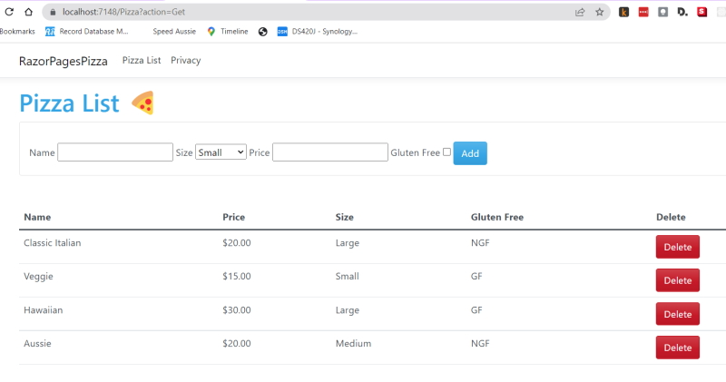

# Learning Razor Pages

## What will you be doing?

In this module, you will:

* Understand when and why to use Razor Pages for your ASP.NET Core app.
* Use the .NET CLI to create a Razor Pages app.
* Create a form that supports the app's product data management requirements.
* Run and test the web app.

## What Razor Pages are and the benefit they provide

Razor Pages is a server-side, page-centric programming model for building web UI with ASP.NET Core. Razor Pages provide the following benefits:

* Makes it easy to get started building dynamic web apps when all you need is to define UI logic using a combination of HTML, CSS, and C#.
* Encourages organization of files by feature, which eases maintenance of your app.
* Can be broadly described as an HTML file in which you work with markup as you're used to. You also have the advantage of adding server-side C# code by using Razor syntax.

Razor Pages use a markup language called [Razor](https://docs.microsoft.com/en-us/aspnet/core/mvc/views/razor?view=aspnetcore-6.0) for embedding server-based code into webpages. Razor syntax is a combination of HTML and C# where the C# code defines the dynamic rendering logic for the page. In a webpage that uses the Razor syntax, there can be two kinds of content: client content and server code:

* Client content: Contains what you're used to in webpages: HTML markup (elements), style information such as CSS, maybe some client script such as JavaScript, and plain text.
* Server code: Razor enables you to add server code to your client content. If there's server code in the page, the server runs that code first, before it sends the page to the browser. By running on the server, the code can perform more complex tasks than using client content alone. For example, securely accessing databases. Most importantly, server code can dynamically create client content — it can generate HTML markup or other content and send it to the browser along with any static HTML that the page might contain. From the browser's perspective, client content generated on the server is no different than any other client content.

## Separation of concerns in the ``PageModel``

Razor Pages enforces separation of concerns for page-related data properties and logic operations in a C# ``PageModel`` class. A model object typically defines data properties and encapsulates any logic or operations related to those data properties. More specifically, a ``PageModel``:

* Encapsulates the data properties and logic operations scoped just to its Razor page.
* Defines page handlers for HTTP requests sent to the page and for the data used to render the page.

## When to use Razor Pages

Use Razor Pages in your ASP.NET Core app when you:

* Want to generate dynamic web UI from your ASP.NET Core app.
* Prefer a page-focused approach to developing web apps, where the page markup and ``PageModel`` are in close proximity.
* Want your page-focused ASP.NET Core app to use partial views - mechanisms for reducing duplication of common markup across the site.

Razor Pages allow you to keep your ASP.NET Core pages organized in a simpler way:

* All view (page) specific logic and page properties defined in the Razor page's (``PageModel``) can be kept together in their own namespace and directory.
* Groups of related pages can be kept in their own namespace and directory.

> **Note**
>
> ASP.NET Core also supports the MVC pattern for building web apps. The ``Model`` defines the fundamental behaviors and data for the app and its components. The ``View`` uses HTML and Razor syntax to provide the UI. The ``Controller`` is a class that receives HTTP requests and handles user actions.
>
> Use ASP.NET Core MVC when you prefer to build web apps with a clear separation between the Model, View, and Controller.
>
> Razor Pages is built on the same infrastructure as ASP.NET Core MVC. Both Razor Pages and MVC can be used within the same ASP.NET Core app. ASP.NET Core MVC is outside of the scope for this module.

## Create new ASP.NET Core app

The .NET CLI is the simplest way to create an ASP.NET Core web app. The CLI is pre-installed when you installed the .NET SDK. In this unit, you'll use the .NET CLI to create an ASP.NET Core web app locally. You'll also gain an understanding of the resulting project.

We are going to create a simple app names **RazorPagesPizza** from the command line.

Create a new folder named **RazorPagesPizza**.

Open Visual Studio Code

At the command prompt create a new web application.

```bash
    dotnet new webapp -f net6.0
```

Run your application.

```bash
    dotnet run
```

## Program Structure

**Program.cs** serves as the application's managed entry point.

**wwwroot** holds all of the static content for our website. This includes a CSS, JavaScript and LIB folders. CSS contains a ``site.css`` file where we can modify our styles. The JavaScript folder contains a single script named site.js for our JavaScript code. LIB contains the Bootstrap CSS files for our page layout.

**Pages** is where our Razor Pages reside. At present there are only two pages we see on our simple website, Index.cshtml and Privacy.cshtml.

### Privacy.cshtml

```csharp
    @page
    @model PrivacyModel
   
   @{
        ViewData["Title"] = "Privacy Policy";
    }
   
   <h1>@ViewData["Title"]</h1>

    <p>Use this page to detail your site's privacy policy.</p>
```

This page contains the markup with C# code using Razor syntax.

We also have a C# PageModel class that defines page handler methods and data used to render the page.

### Privacy.cshtml.cs

```csharp
    using Microsoft.AspNetCore.Mvc;
    using Microsoft.AspNetCore.Mvc.RazorPages;

    namespace RazorPagesPizza.Pages;

    public class PrivacyModel : PageModel
    {
        private readonly ILogger<PrivacyModel> _logger;

        public PrivacyModel(ILogger<PrivacyModel> logger)
        {
            _logger = logger;
        }

        public void OnGet()
        {
        }
    }
```

This code is setting up logging using dependency injection and has an ``OnGet()`` method.

We have a ``.cshtml`` and ``.cs`` paired page model so that we can have a separation of concerns. We could add inline ``.cs`` code to the ``.cshtml`` page but it gets complicated doing this.

## Pages/Shared

Contains partial markup elements that are shared across several Razor pages.

* _Layout.cshtml: Provides common layout elements across multiple pages.
* _ValidationScriptsPartial.cshtml: Provides validation functionality such as client-side form input validation and cross-site anti-forgery validation. This partial view is available to all pages in the project.

### _Layout.cshtml

Is used to provide layout content to our Razor pages. It provides the header and footer for all pages. 

#### header code

```html
    <!DOCTYPE html>
    <html lang="en">
    <head>
        <meta charset="utf-8" />
        <meta name="viewport" content="width=device-width, initial-scale=1.0" />
        <title>@ViewData["Title"] - RazorPagesPizza</title>
        <link rel="stylesheet" href="~/lib/bootstrap/dist/css/bootstrap.min.css" />
        <link rel="stylesheet" href="~/css/site.css" asp-append-version="true" />
        <link rel="stylesheet" href="~/RazorPagesPizza.styles.css" asp-append-version="true" />
    </head>
    <body>
        <header>
            <nav class="navbar navbar-expand-sm navbar-toggleable-sm navbar-light bg-white border-bottom box-shadow mb-3">
                <div class="container">
                    ...
```

#### footer code

```html
    <footer class="border-top footer text-muted">
        <div class="container">
            &copy; 2022 - RazorPagesPizza - <a asp-area="" asp-page="/Privacy">Privacy</a>
        </div>
    </footer>
```

At the bottom of the page we load our jQuery and site.js file.

```html
    <script src="~/lib/jquery/dist/jquery.min.js"></script>
    <script src="~/lib/bootstrap/dist/js/bootstrap.bundle.min.js"></script>
    <script src="~/js/site.js" asp-append-version="true"></script>

    @await RenderSectionAsync("Scripts", required: false)
```

After the header and navigation bar code we have a ``@RenderBody()`` method and this is where our page code is loaded to build up a complete page.

```html
    <div class="container">
        <main role="main" class="pb-3">
            @RenderBody()
        </main>
    </div>
```

## Layouts and partial view files

* Layouts: In ASP.NET layouts are ``.cshtml`` files that define a top-level template for views in the application. Apps don't require a layout and apps can also define more than one layout with different views specifying different layouts. Most web applications have a common layout that provides a consistent user experience. The layout typically includes common UI elements such as the app header, navigation, menu elements and footer. Common HTML structures such as scripts and stylesheets are also frequently used by many pages within an app. All of these shared elements maybe defined in a layout file, which can then be referenced by any view used within the app. Layouts reduce duplicate code in views.
* Partial Views: A partial view is a Razor markup file (``.cshtml``) that renders HTML output within another markup file's rendered output. Partial views are used to break up large markup files into smaller components. They also reduce duplication of common markup content across markup files. Partial views aren't used to maintain common elements. Common layout elements are specified in a ``_Layout.cshtml`` file.

## The Pages directory structure and routing requests

Razor pages use the directory structure within the Pages directory as the convention for routing requests by default.

| URL  	                            | Maps to this Razor page  	    |
|:----------------------------------|:------------------------------|
| www.domain.com  	                | Pages/Index.cshtml    	    |
| www.domain.com/index  	        | Pages/Index.cshtml    	    |
| www.domain.com/products  	        | Pages/Products/Index.cshtml  	|
| www.domain.com/products/create   	| Pages/Products/Create.cshtml 	|

## Create a page

```bash
    dotnet new page --name Pizza --namespace RazorPagesPizza.Pages --output Pages
```

The preceding command:

Creates the following files in the ``RazorPagesPizza.Pages`` namespace:

**Pizza.cshtml** - The Razor page
**Pizza.cshtml.cs** - The accompanying PageModel class

Stores both files in the project's Pages directory.

**Note:** that there's nothing magical about using the CLI to create these files. You can also create the files manually; the CLI command is just a shortcut for doing so.

### Pizza.cshtml

```csharp
    @page
    @model RazorPagesPizza.Pages.PizzaModel
    @{
    }
```

The preceding Razor page contains reserved Razor keywords:

The ``@page`` directive is what makes the page a Razor page. It indicates the page can handle HTTP requests. The ``@page`` directive must be the first directive on a Razor page.
The ``@model`` directive specifies the model type made available to the Razor page. In this case, the type is the PageModel-derived class name, prefixed with its namespace. As you recall, that class is defined in ``Pages/Pizza.cshtml.cs``.

## Render HTML and transition to C #

The following markup is an example of an ``@`` symbol followed by C# code. The code sets the ``ViewData`` collection's ``Title`` key value to ``Create``. Razor syntax uses the ``@`` symbol to transition from HTML to C#. If the ``@`` symbol is followed by a Razor reserved keyword, it transitions into Razor-specific markup; otherwise, it transitions to C#. Razor evaluates the C# expressions and renders them in the HTML output.

```cshtml
    @{
        ViewData["Title"] = "Pizza";
    }
```

A Razor page supports Razor syntax, which is HTML and C# combined. The C# code defines the dynamic rendering logic for the page on the server. The default Razor language is HTML. Rendering HTML from Razor markup is no different than rendering HTML from an HTML file. HTML markup in ``.cshtml`` Razor page files is rendered by the server unchanged. In Razor Pages, HTML can be used as you're used to. At the same time, you can take advantage of powerful and time-saving Razor features as you learn to use them.

## Add Pizza and PizzaService classes

Before you start to implement the form to manage pizzas, you need to have a data store that you can perform operations on.

A ``model`` class is needed to represent a pizza in inventory. The model contains properties that represent the characteristics of a pizza. The model is used to pass data in the web app and to persist pizza options in the data store. In this unit, that data store will be a simple local in-memory caching service. In a real-world application, you would consider using a database, such as SQL Server, with Entity Framework Core.

## Create a pizza model

Run the following command in your project's root directory to create a ``Models`` folder:

```bash
    mkdir Models
```

Select the ``Models`` folder in Visual Studio Code and add a new File called **Pizza.cs**.

Add the following code to **Models/Pizza.cs** to define a pizza.

### Models/Pizza.cs

```csharp
    using System.ComponentModel.DataAnnotations;

    namespace RazorPagesPizza.Models;

    public class Pizza
    {
        public int Id { get; set; }

        [Required]
        public string? Name { get; set; }
        public PizzaSize Size { get; set; }
        public bool IsGlutenFree { get; set; }

        [Range(0.01, 9999.99)]
        public decimal Price { get; set; }
    }

    public enum PizzaSize { Small, Medium, Large }
```

## Add data service

Run the following command in your project's root directory to create a **Services** folder:

```bash
    mkdir Services
```

Select the folder in Visual Studio Code and add a new File called ``PizzaService.cs``.

Add the following code to **Services/PizzaService.cs** to create an in-memory pizza data service. 

### Services/PizzaService.cs

```csharp
    using RazorPagesPizza.Models;

    namespace RazorPagesPizza.Services;

    public static class PizzaService
    {
        static List<Pizza> Pizzas { get; }
        static int nextId = 3;
        static PizzaService()
        {
            Pizzas = new List<Pizza>
                    {
                        new Pizza { Id = 1, Name = "Classic Italian", Price=20.00M, Size=PizzaSize.    Large, IsGlutenFree = false },
                        new Pizza { Id = 2, Name = "Veggie", Price=15.00M, Size=PizzaSize.Small,     IsGlutenFree = true }
                    };
        }

        public static List<Pizza> GetAll() => Pizzas;

        public static Pizza? Get(int id) => Pizzas.FirstOrDefault(p => p.Id == id);

        public static void Add(Pizza pizza)
        {
            pizza.Id = nextId++;
            Pizzas.Add(pizza);
        }

        public static void Delete(int id)
        {
            var pizza = Get(id);
            if (pizza is null)
                return;

            Pizzas.Remove(pizza);
        }

        public static void Update(Pizza pizza)
        {
            var index = Pizzas.FindIndex(p => p.Id == pizza.Id);
            if (index == -1)
                return;

            Pizzas[index] = pizza;
        }
    }
```

## Add form markup to the Pizza Razor page

Replace the contents of **Pages/Pizza.cshtml** with the following markup. Save your changes.

### Pages/Pizza.cshtml

```csharp
    @page
    @using RazorPagesPizza.Models
    @model RazorPagesPizza.Pages.PizzaModel
    @{
        ViewData["Title"] = "Pizza List";
    }

    <h1>Pizza List 🍕</h1>
    <form method="post" class="card p-3">
        <div class="row">
            <div asp-validation-summary="All"></div>
        </div>
        <div class="form-group mb-0 align-middle">
            <label asp-for="NewPizza.Name">Name</label>
            <input type="text" asp-for="NewPizza.Name" class="mr-5">
            <label asp-for="NewPizza.Size">Size</label>
            <select asp-for="NewPizza.Size" asp-items="Html.GetEnumSelectList<PizzaSize>()" class="mr-5"></select>
            <label asp-for="NewPizza.Price"></label>
            <input asp-for="NewPizza.Price" class="mr-5" />
            <label asp-for="NewPizza.IsGlutenFree">Gluten Free</label>
            <input type="checkbox" asp-for="NewPizza.IsGlutenFree" class="mr-5">
            <button class="btn btn-primary">Add</button>
        </div>
    </form>
    <table class="table mt-5">
        <thead>
            <tr>
                <th scope="col">Name</th>
                <th scope="col">Price</th>
                <th scope="col">Size</th>
                <th scope="col">Gluten Free</th>
                <th scope="col">Delete</th>
            </tr>
        </thead>
        @foreach (var pizza in Model.pizzas)
        {
            <tr>
                <td>@pizza.Name</td>
                <td>@($"{pizza.Price:C}")</td>
                <td>@pizza.Size</td>
                <td>@Model.GlutenFreeText(pizza)</td>
                <td>
                    <form method="post" asp-page-handler="Delete" asp-route-id="@pizza.Id">
                        <button class="btn btn-danger">Delete</button>
                    </form>
                </td>
            </tr>
        }
    </table>

    @section Scripts {
    <partial name="_ValidationScriptsPartial" />
    }
```

The Pizza Razor page uses HTML and Razor to support a product creation form. The form accepts **Name** and **Price** values for the product to be created. With relatively little markup, dynamic features have been provided through Razor Tag Helpers. Client-side form input validation is enabled via the inclusion of the *Pages/Shared/_ValidationScriptsPartial.cshtml* partial view. The partial view's contents are injected into the layout page's Scripts section.

## Review Razor Tag Helpers

Tag Helpers address the inefficiencies of context switching between HTML and C#. Most of ASP.NET Core's built-in Tag Helpers extend standard HTML elements. Tag Helpers provide additional server-side attributes for HTML elements, making the elements more robust.

There are four Tag Helpers on this page:

* Partial
* Label
* Input
* Validation Summary Message

### Partial Tag Helper

The following markup uses the Partial Tag Helper to asynchronously render a partial view:

```html
    <partial name="_ValidationScriptsPartial" />
```

The Partial Tag Helper's ``name`` attribute accepts the partial view name without the file extension. A view discovery process locates the partial view in the project.

This Tag Helper syntax is an alternative to the following HTML Helper syntax:

```csharp
    @{await Html.RenderPartialAsync("_ValidationScriptsPartial");}
```

### Label Tag Helper

The following markup uses the Label Tag Helper:

```html
    <label asp-for="NewPizza.Name" class="control-label"></label>
```

The Label Tag Helper extends the standard HTML ``<label>`` element. As is common for many Tag Helpers, it uses an ``asp-for`` attribute. The attribute accepts a specified PageModel property. In this case, the value of the ``PageModel`` Name property will be rendered as the content for an HTML ``<label>`` element. The ``asp-for`` attribute is scoped to the ``PageModel`` for the Razor page, so the ``@`` symbol isn't used. The label is dynamic as is needed here, but remains compact and easy to add in your markup.

### Input Tag Helper

The following markup uses the Input Tag Helper. It extends the standard HTML ``<input>`` element. It also uses an ``asp-for`` attribute to specify a ``PageModel`` property.

```html
    <input asp-for="NewPizza.Name" class="form-control" />
```

**The Input Tag Helper:**

* Evaluates the **NewPizza.Name** property, like the Label Tag Helper.
* Adds an ``id`` and ``name`` HTML attribute based on that property.
* Sets the input type appropriately. For example, if the specified property type is ``bool``, an input type of ``checkbox`` is used in the generated HTML. In this case, the ``NewPizza.Name`` property type is string. The ``NewPizza.Name`` property is set by the model's data annotation attributes, which will be reviewed later in this module.
* Provides client-side validation using jQuery, based on the model's data annotation attributes provided through the ``PageModel``.
* Prompts the Razor engine to provide additional, more robust server-side validation, if client-side validation was successful. The *Pizza* Razor page's **HTTP POST** event lifecycle, which includes client-side and server-side input validation, is walked through later in this module.

The following HTML output is generated from the Input Tag Helper located in the *Pizza* page:

```html
    <input name="NewPizza.Name" class="form-control" id="NewPizza_Name" type="text" value="" data-val-required="The Name field is required." data-val="true">
```

### Validation Summary Tag Helper

The following markup uses the Validation Summary Tag Helper. It displays a validation message for a single property on the model.

```html
    <div asp-validation-summary="All"></div>
```

The Input Tag Helper adds HTML5 ``data-`` attributes to input elements. The attributes are based on properties in the C# model classes. While responsive client-side validation occurs, validation is also done on the server, which is more secure.

The following HTML is rendered by the Validation Summary Tag Helper:

```html
    <input name="NewPizza.Price" class="form-control" id="NewPizza_Price" type="text" value="" data-val-required="The Price field is required." data-val="true" data-val-range-min="0.01" data-val-range-max="9999.99" data-val-range="The field Price must be between 0.01 and 9999.99." data-val-number="The field Price must be a number.">
```

The type, ``data-val-range-min``, ``data-val-range-max``, and error response are dynamically set by the model's data annotations for the model's ``Product.Price`` property.

The product creation Razor page has been created. In order to process form interactions, you'll need to modify the ``PageModel`` class to handle the form's HTTP POST request. Let's explore ``PageModel`` interactions next.

## Handle interactions in PageModel handler methods

In this unit, you'll review the structure of a Razor page ``PageModel`` class and its components. You'll learn how page handlers interact with your Razor page. Finally, you'll walk through the ``Pizza`` model and its data annotations that drive both client-side and server-side validation.

### Examine the structure of a Razor Pages ``PageModel`` class

A new ``PageModel`` class file contains the following C# code:

```csharp
    using Microsoft.AspNetCore.Mvc;
    using Microsoft.AspNetCore.Mvc.RazorPages;

    namespace RazorPagesPizza.Pages
    {
        public class PizzaModel : PageModel
        {
            public void OnGet()
            {
            }
        }
    }
```

A Razor page's ``PageModel`` class file defines any page handlers for HTTP requests sent to the page, and data used to render the page. The ``PageModel`` keeps those concerns separate from the Razor page, your app more modular, and easier to maintain. By convention, the ``PageModel`` class is named [PageName]Model and resides in the same namespace as the Razor page. In this case, the PizzaModel class in the namespace of RazorPagesPizza.Pages.

Currently, the ``PizzaModel`` class handles the HTTP GET request with an empty ``OnGet`` page handler. You can add handlers for any HTTP verb. The most common handlers are:

``OnGet`` to initialize state needed for the page.
``OnPost`` to handle form submissions.

The *Pizza* page contains a form and therefore requires an HTTP POST page handler.

## HTTP POST page handlers in a PageModel

The ``OnPostAsync`` page handler needs to perform the following tasks for this app:

* Verify the user-submitted data posted to the ``PageModel`` is valid.
* If the attempted ``PageModel`` changes are invalid, the *Pizza* page is presented again to the user. A message is displayed clarifying the input requirements.
* If the ``PageModel`` update is valid, then data changes are passed to a service called ``PizzaService``. The ``PizzaService`` will handle the concern persisting the data.

## Bind the model

The ``PizzaModel`` class needs access to the ``Pizza`` model. It will validate and pass ``Pizza`` entries from the *Pizza* form. It does so by using the ``[BindProperty]`` attribute in the following code:

```csharp
    [BindProperty]
    public Pizza NewPizza { get; set; }
```

Binding to properties can reduce the amount of code you have to write. Binding reduces code by using the same property to render fields such as in ``<input asp-for="Pizza.Name">``.

**Note:** by using the ``[BindProperty]`` you can use the Model to connect both the ``Markup`` (.cshtml) page and the PageModel (.cs).

## Built-in server-side model validation using ASP.NET Core data annotations

Model binding and validation are available when you create a ASP.NET Core web app. Both automatically occur before the execution of a page handler. So the ``OnPostAsync`` page handler only needs to verify the outcome of that validation.

```csharp
    if (!ModelState.IsValid)
    {
        return Page();
    }
```

In the preceding code, ``ModelState`` represents errors from model binding and validation. If the ``ModelState`` is invalid, then the ``Pizza`` page is presented again to the user. In the previous unit, you saw how the ``Pizza`` Razor page uses ASP.NET Core's built-in client-side form input validation to responsively provide the user with input validation feedback.

If the ``ModelState`` is valid, the OnPostAsync page handler calls upon an instance of ``PizzaService``. ``PizzaService`` is responsible for storing the information - in this case, using an in-memory data store.

## Define validation rules for the Pizza model using data annotations

This project uses a central model file *Pizza.cs* for ``Pizza`` model validation and operations. It's used by all Razor page PageModels involved in UI for ``Pizza`` CRUD operations, and is used to validate ``Pizza`` data received from the web api. By convention, it's stored in the Models directory. The ``Pizza`` model's namespace is RazorPagesPizza.Models.

Your new ``PizzaModel`` class gained access to any model types defined in the ``RazorPagesPizza.Models`` namespace, including the ``Pizza`` model, with the following ``using`` directive:

```csharp
    using RazorPagesPizza.Models;
```

Examine the ``Pizza`` model class:

```csharp
    using System.ComponentModel.DataAnnotations;

    namespace RazorPagesPizza.Models
    {
        public class Pizza
        {
            public int Id { get; set; }

            [Required]
            public string Name { get; set; }
            public PizzaSize Size { get; set; }
            public bool IsGlutenFree { get; set; }

            [Range(0.01, 9999.99)]
            public decimal Price { get; set; }
        }

        public enum PizzaSize { Small, Medium, Large }
    }
```

Data annotations are attributes that specify behaviors you want to enforce on the model properties to which they're applied.

The ``Pizza`` class uses the:

* ``[Required]`` attribute to indicate that a property must have a value.
* ``[Range]`` attribute to constrain a value to a specific range.

If you decide to enforce more validation rules, you can easily modify attributes in just one place, the ``Pizza`` model, without being required to modify any of the ``PageModel`` class files in the project. A significant benefit!

A comprehensive set of data annotation attributes is available to you in the ``System.ComponentModel.DataAnnotations`` namespace. For the scope of this module, a simplified example is provided.

### The Pizza model as a data transfer object

The ``Pizza`` model also serves as a Data Transfer Object (DTO). A DTO is an object that defines the data that will be sent over the network, in this case to the web API. In a more advanced version of this application, the ``RazorPagesPizza`` project's ``PizzaService`` class would use the ``Pizza`` model as a DTO that defines valid Pizza data that can be sent to and received from the web API or backing database.

Next, you'll update the ``PizzaModel`` interact with the ``PizzaService`` class to list existing pizzas and create new ones.

## Handle the Pizza form submission

In this unit, you'll add a HTTP POST page handler for the *Pizza* Razor page form. Finally, you'll walk through the ``Pizza`` model and its data annotations that drive both client-side and server-side validation.

### Examine the structure of a Razor Pages PageModel class

Open the *Pages/Pizza.cshtml.cs* ``PageModel`` class file. You may remember, that when you created a new Razor page called Pizza, its ``PageModel`` class file named *Pizza.cshtml.cs* was generated.

#### Pages/Pizza.cshtml.cs

```csharp
    using Microsoft.AspNetCore.Mvc;
    using Microsoft.AspNetCore.Mvc.RazorPages;

    namespace RazorPagesPizza.Pages
    {
        public class PizzaModel : PageModel
        {
            public void OnGet()
            {
            }
        }
    }
```

## Update the HTTP Get page handler to display the list of Pizzas

Currently, the ``PizzaModel`` class handles the HTTP GET request with an empty ``OnGet`` page handler. Let's update this to display a list of pizzas from the ``PizzaService``.

### Update the OnGet page handler

Update the ``OnGet`` method as follows:

```csharp
    public void OnGet()
    {
        pizzas = PizzaService.GetAll();
    }
```

Add a ``List<Pizza>`` variable named ``pizzas`` to the ``PizzaModel`` class:

```csharp
    public List<Pizza> pizzas = new();
```

When the ``OnGet`` method is called, it will assign the results of the ``PizzaService.GetAll()`` method to the ``pizzas`` variable. This variable will be accessible to the Razor page template, where it will be written to the table listing the available pizzas.

These statements are referencing the ``PizzaService`` and ``Pizza`` classes, so you'll need to add the following using statements to the top of the ``PizzaModel`` class:

```csharp
    using RazorPagesPizza.Models;
    using RazorPagesPizza.Services;
```

### Use a utility method to format the Gluten Free information in the list

The ``IsGlutenFree`` property is a boolean value. You can use a utility method to format the boolean value as a string. Add the following utility method to the ``PizzaModel`` class:

```csharp
    public string GlutenFreeText(Pizza pizza)
    {
        if (pizza.IsGlutenFree)
        {
            return "GF";
        }
        else
        {
            return "NGF";
        }
    }
```

**Note:** this is a really valuable way of working. You need to minimise the amount of logic that you add to the .cshtml page. In our ``Pizza`` model ``IsGlutenFree`` is a boolean and we don't want to add a true or false to the page. We handle this in the ``PageModel`` (``PizzaModel``) and change the boolean value to a string value as a message.



You can see the *Gluten Free* column showing either a **GF** or **NGF** result.

## Add an HTTP POST page handler to the ``PageModel``

Add the following method to the *Pages/Pizza.cshtml.cs* ``PageModel`` class. Save your changes.

```csharp
    public IActionResult OnPost()
    {
        if (!ModelState.IsValid)
        {
            return Page();
        }
    
        PizzaService.Add(NewPizza);
    
        return RedirectToAction("Get");
    }
```

The ``PizzaModel`` class now has an asynchronous ``OnPost`` page handler. ``OnPost`` executes when the user posts the ``Pizza`` page's form. You can also use the optional Async naming suffix, ``OnPostAsync``.

The ``OnPost`` page handler needs to perform the following tasks for this app:

* Verify the user-submitted data posted to the ``PageModel`` is valid.
* If the attempted ``PageModel`` changes are invalid, the *Pizza* page is presented again to the user. A message is displayed clarifying the input requirements.
* If the ``PageModel`` update is valid, then data changes are passed to a service called ``PizzaService``. ``PizzaService`` will handle the concern of HTTP requests and responses to the web API.

**Note:** ``return RedirectToAction("Get");`` is basically calling for a page reload. There are other ways that this can be handled.

### Bind the model

The ``PizzaModel`` class needs access to the ``Pizza`` model. It will validate and pass Pizza entries from the Pizza form using the ``[BindProperty]`` attribute. Add the following code to your ``PizzaModel`` class:

```csharp
    [BindProperty]
    public Pizza NewPizza { get; set; } = new();
```

## Add an HTTP POST handler for the Delete buttons

A Razor page can include multiple forms. Since the Delete buttons in your list of pizzas modifies data, an HTTP POST rather that an HTTP GET is required.

Add the following ``OnPostDelete`` method to the ``PizzaModel`` class:

```csharp
    public IActionResult OnPostDelete(int id)
    {
        PizzaService.Delete(id);
        return RedirectToAction("Get");
    }
```

## Link to the Pizza page

The Pizza page has been created and implemented. Let's allow users to navigate to it.

### Add an Anchor Tag Helper to the Index page

In *Pages/Shared/Layout.cshtml*, add the following code to the ``<nav>`` section between the ``Home`` and ``Privacy`` links:

```html
    <div class="navbar-collapse collapse d-sm-inline-flex justify-content-between">
        <ul class="navbar-nav flex-grow-1">
            <li class="nav-item">
                <a class="nav-link text-dark" asp-area="" asp-page="/Index">Home</a>
            </li>
            <li class="nav-item">
                <a class="nav-link text-dark" asp-area="" asp-page="/Pizza">Pizza List</a>
            </li>
            <li class="nav-item">
                <a class="nav-link text-dark" asp-area="" asp-page="/Privacy">Privacy</a>
            </li>
        </ul>
    </div>
```

The preceding highlighted code uses an Anchor Tag Helper. The Tag Helper:

* Directs the user to the **Pages/Pizza** Razor page, located in the same directory as the Index page.
* Enhances the standard HTML anchor (``<a>``) tag by adding custom HTML attributes, such as ``asp-page-handler``.

The ``asp-page-handler`` attribute is used to route to a specific page handler for the Razor page defined in the ``asp-page`` attribute. The ``asp-page`` attribute is used set an anchor tag's ``href`` attribute value to a specific Razor page.

## Summary

In this module, you examined the Razor Pages architecture in an ASP.NET Core app. This app provided a UI for updating and deleting product listings exposed through a web API endpoint. You added a product creation form, taking advantage of Razor Tag Helpers. With Tag Helpers, you quickly added client-side and server-side validation. You also gained cross-site antiforgery validation. You coded its PageModel class that provided a separation of concern for the page's logic operations and data properties.

### Next steps

Take a deeper dive into the documentation. The following ASP.NET Core features and concepts were introduced in this module:

* [Razor Pages](https://docs.microsoft.com/en-us/aspnet/core/razor-pages/)
* [Razor syntax reference](https://docs.microsoft.com/en-us/aspnet/core/mvc/views/razor)
* [Tag Helpers](https://docs.microsoft.com/en-us/aspnet/core/mvc/views/working-with-forms)
* [Partial views](https://docs.microsoft.com/en-us/aspnet/core/mvc/views/partial)
* [Layout](https://docs.microsoft.com/en-us/aspnet/core/mvc/views/layout)
* [Routing](https://docs.microsoft.com/en-us/aspnet/core/fundamentals/routing)
* [Dependency injection](https://docs.microsoft.com/en-us/aspnet/core/fundamentals/dependency-injection)
* [Make HTTP requests using a typed client pattern](https://docs.microsoft.com/en-us/aspnet/core/fundamentals/http-requests#consumption-patterns)

## Learn more with a Channel 9 video series

* [.NET Core 101](https://channel9.msdn.com/Series/NET-Core-101/?WT.mc_id=Educationaldotnet-c9-scottha)
* [ASP.NET Core 101](https://channel9.msdn.com/Series/ASPNET-Core-101/?WT.mc_id=Educationaspnet-c9-niner)
