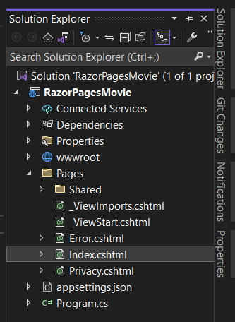
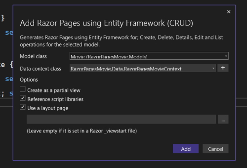
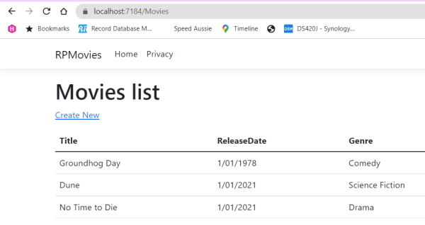
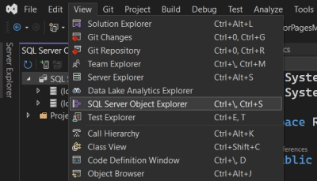
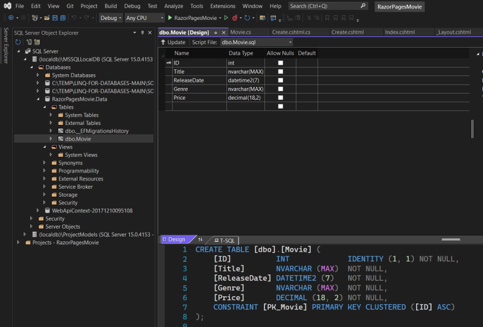
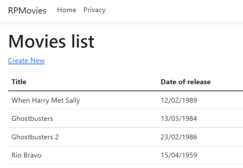

# Get started with Razor Pages in ASP.NET Core

App source code: ``Sandbox\RazorPagesMovie``

## Create an ASP.Net Core WebApp

In this process there are two checkbox options.

Configure for https: - Check this.

Do not use top-level statements: - Check this.

This option will allow you to use a Namespace and Class structure in your C# files.

This file structure is created.



You can run the application with ``CTRL-F5``.

Visual Studio:

Runs the app, which launches the [Kestrel server](https://docs.microsoft.com/en-us/aspnet/core/fundamentals/servers/kestrel?view=aspnetcore-6.0).

Launches the default browser at <https://localhost:7184/>, which displays the apps UI.

### Pages folder

Contains Razor pages and supporting files. Each Razor page is a pair of files:

A .cshtml file that has HTML markup with C# code using Razor syntax.

A .cshtml.cs file that has C# code that handles page events.

Supporting files have names that begin with an underscore. For example, the *_Layout.cshtml* file configures UI elements common to all  pages. This file sets up the navigation menu at the top of the page and the copyright notice at the bottom of the page. For more information, see [Layout in ASP.NET Core](https://docs.microsoft.com/en-us/aspnet/core/fundamentals/configuration/?view=aspnetcore-6.0).

### wwwroot folder

Contains static assets, like HTML files, JavaScript files, and CSS files. For more information, see [Static files in ASP.NET Core](https://docs.microsoft.com/en-us/aspnet/core/fundamentals/static-files?view=aspnetcore-6.0).

### appsettings.json

Contains configuration data, like connection strings. For more information, see [Configuration in ASP.NET Core](https://docs.microsoft.com/en-us/aspnet/core/fundamentals/configuration/?view=aspnetcore-6.0).

### Program.cs

Contains the following code:

```csharp
    var builder = WebApplication.CreateBuilder(args);

    // Add services to the container.
    builder.Services.AddRazorPages();

    var app = builder.Build();

    // Configure the HTTP request pipeline.
    if (!app.Environment.IsDevelopment())
    {
        app.UseExceptionHandler("/Error");
        // The default HSTS value is 30 days. You may want to change this for production scenarios, see https://aka.ms/aspnetcore-hsts.
        app.UseHsts();
    }

    app.UseHttpsRedirection();

    app.UseStaticFiles();

    app.UseRouting();

    app.UseAuthorization();

    app.MapRazorPages();

    app.Run();
```

The following lines of code in this file create a ``WebApplicationBuilder`` with preconfigured defaults, add Razor Pages support to the [Dependency Injection (DI) container](<https://docs.microsoft.com/en-us/aspnet/core/fundamentals/dependency-injection?view=aspnetcore-6.0>), and build the app:

```csharp
    var builder = WebApplication.CreateBuilder(args);

    // Add services to the container.
    builder.Services.AddRazorPages();

    var app = builder.Build();
```

The developer exception page is enabled by default and provides helpful information on exceptions. Production apps should not be run in development mode because the developer exception page can leak sensitive information.

The following code sets the exception endpoint to /Error and enables [HTTP Strict Transport Security Protocol (HSTS)](https://docs.microsoft.com/en-us/aspnet/core/security/enforcing-ssl?view=aspnetcore-6.0#http-strict-transport-security-protocol-hsts) when the app is not running in development mode:

```csharp
    // Configure the HTTP request pipeline.
    if (!app.Environment.IsDevelopment())
    {
        app.UseExceptionHandler("/Error");
        // The default HSTS value is 30 days. You may want to change this for production scenarios, see https://aka.ms/aspnetcore-hsts.
        app.UseHsts();
    }
```

For example, the preceding code runs when the app is in production or test mode. For more information, see [Use multiple environments in ASP.NET Core](https://docs.microsoft.com/en-us/aspnet/core/fundamentals/environments?view=aspnetcore-6.0).

The following code enables various Middleware:

``app.UseHttpsRedirection();`` : Redirects HTTP requests to HTTPS.

``app.UseStaticFiles();`` : Enables static files, such as HTML, CSS, images, and JavaScript to be served. For more information, see Static files in ASP.NET Core.

``app.UseRouting();`` : Adds route matching to the middleware pipeline. For more information, see Routing in ASP.NET Core

``app.MapRazorPages();Z`` : Configures endpoint routing for Razor Pages.

``app.UseAuthorization();`` : Authorizes a user to access secure resources. This app doesn't use authorization, therefore this line could be removed.

``app.Run();`` : Runs the app.

## Add a model to a Razor Pages app in ASP.NET Core

In this tutorial, classes are added for managing movies in a database. The app's model classes use [Entity Framework Core (EF Core)](https://docs.microsoft.com/en-us/ef/core) to work with the database. EF Core is an object-relational mapper (O/RM) that simplifies data access. You write the model classes first, and EF Core creates the database.

The model classes are known as **POCO** classes (from "Plain-Old CLR Objects") because they don't have a dependency on EF Core. They define the properties of the data that are stored in the database.

### Add a data model

Create a new folder on the root of your project named **Models** and add a new class named **Movie**.

```csharp
    using System.ComponentModel.DataAnnotations;

    namespace RazorPagesMovie.Models
    {
        public class Movie
        {
            public int ID { get; set; }
            public string Title { get; set; } = string.Empty;

            [DataType(DataType.Date)]
            public DateTime ReleaseDate { get; set; }
            public string Genre { get; set; } = string.Empty;
            public decimal Price { get; set; }
        }
    }
```

We are using data annotations for the **ReleaseDate** property to set the data type. By adding this the user doesn't have to enter Time information in the date field and only the date is shown, not the time information.

Build the project to make sure there are no errors.

### Scaffold the movie model

In this section, the movie model is scaffolded. That is, the scaffolding tool produces pages for Create, Read, Update, and Delete (CRUD) operations for the movie model.

1. Open NuGet package manager and browse to **Microsoft.EntityFrameworkCore.Design** and add it to your project.
2. Create the **Pages/Movies** folder.
3. Right-click on the **Pages/Movies** folder > **Add > New Scaffolded Item**.
4. In the Add New Scaffold dialog, select Razor Pages using Entity Framework (CRUD) > **Add**.



**Model class**: Movie (RazorPagesMovie.Models)
**Data context class**: RazorPagesMovie.Data.RazorPagesMovieContext

The ``appsettings.json`` file is updated with the connection string used to connect to a local database.

### Files created and updated

The scaffold process creates the following files:

Pages/Movies: Create, Delete, Details, Edit, and Index.

Data/RazorPagesMovieContext.cs

The scaffold process updates the **Program.cs** file.

#### using statements

```csharp
    using Microsoft.EntityFrameworkCore;
    using Microsoft.Extensions.DependencyInjection;
    using RazorPagesMovie.Data;
```

#### db context

```csharp
    var builder = WebApplication.CreateBuilder(args);
        
        // Adds this db context
        builder.Services.AddDbContext<RazorPagesMovieContext>(options =>
            options.UseSqlServer(builder.Configuration.GetConnectionString("RazorPagesMovieContext") ?? throw newInvalidOperationException("Connection string 'RazorPagesMovieContext' not found.")));
```

## Create the initial database schema using EF's migration feature

The migrations feature in Entity Framework Core provides a way to:

* Create the initial database schema.
* Incrementally update the database schema to keep it in sync with the app's data model. Existing data in the database is preserved.

Open the NuGet Package Manager console 

In the PMC, enter the following commands:

```powershell
    Add-Migration InitialCreate
    Update-Database
```

**Note:** the ``RazorPagesMovie.Data.mdf`` database is stored in my *Users\alanr* folder.

The preceding commands install the [Entity Framework Core](https://docs.microsoft.com/en-us/ef/core/get-started/overview/install#get-the-entity-framework-core-tools) tools and run the migrations command to generate code that creates the initial database schema.

The following warning is displayed, which is addressed in a later step:

> No type was specified for the decimal column 'Price' on entity type 'Movie'. This will cause values to be silently truncated if they do not fit in the default precision and scale. Explicitly specify the SQL server column type that can accommodate all the values using 'HasColumnType()'.

The ``migrations`` command generates code to create the initial database schema. The schema is based on the model specified in ``DbContext``. The ``InitialCreate`` argument is used to name the migrations. Any name can be used, but by convention a name is selected that describes the migration.

The ``update`` command runs the ``Up`` method in migrations that have not been applied. In this case, ``update`` runs the ``Up`` method in the ``Migrations/<time-stamp>_InitialCreate.cs`` file, which creates the database.

### Examine the context registered with dependency injection

ASP.NET Core is built with dependency injection. Services, such as the EF Core database context, are registered with [dependency injection](https://docs.microsoft.com/en-us/aspnet/core/fundamentals/dependency-injection?view=aspnetcore-6.0) during application startup. Components that require these services (such as Razor Pages) are provided via constructor parameters. The constructor code that gets a database context instance is shown later in the tutorial.

The scaffolding tool automatically created a database context and registered it with the dependency injection container. The following highlighted code is added to the ``Program.cs`` file by the scaffolder:

```csharp
    builder.Services.AddDbContext<RazorPagesMovieContext>(options =>
            options.UseSqlServer(builder.Configuration.GetConnectionString("RazorPagesMovieContext") ?? throw newInvalidOperationException("Connection string 'RazorPagesMovieContext' not found.")));
```

The data context ``RazorPagesMovieContext``:

* Derives from [Microsoft.EntityFrameworkCore.DbContext](https://docs.microsoft.com/en-us/dotnet/api/microsoft.entityframeworkcore.dbcontext).
* Specifies which entities are included in the data model.
* Coordinates EF Core functionality, such as Create, Read, Update and Delete, for the ``Movie`` model.

#### Data/RazorPagesMovieContext.cs

```csharp
    using System;
    using System.Collections.Generic;
    using System.Linq;
    using System.Threading.Tasks;
    using Microsoft.EntityFrameworkCore;
    using RazorPagesMovie.Models;

    namespace RazorPagesMovie.Data
    {
        public class RazorPagesMovieContext : DbContext
        {
            public RazorPagesMovieContext (DbContextOptions<RazorPagesMovieContext> options)
                : base(options)
            {
            }

            public DbSet<RazorPagesMovie.Models.Movie> Movie { get; set; }
        }
    }
```

The preceding code creates a [DbSet<Movie>](https://docs.microsoft.com/en-us/dotnet/api/microsoft.entityframeworkcore.dbset-1) property for the entity set. In Entity Framework terminology, an entity set typically corresponds to a database table. An entity corresponds to a row in the table.

The name of the connection string is passed in to the context by calling a method on a [DbContextOptions](https://docs.microsoft.com/en-us/dotnet/api/microsoft.entityframeworkcore.dbcontextoptions) object. For local development, the [Configuration system](https://docs.microsoft.com/en-us/aspnet/core/fundamentals/configuration/?view=aspnetcore-6.0) reads the connection string from the ``appsettings.json`` file.

## Build the App

Build the app. The compiler generates several nullable warnings. 

**Note:** In .Net 6.0 the nullable types are automatically enabled so I don't see these errors.

Fix the warning messages

In this section, you can either disable nullable warnings or fix the scaffolded code. To eliminate the warnings from nullable reference types, remove the following line from the ``RazorPagesMovie.csproj`` file:

```xml
    <Nullable>enable</Nullable>
```

Rather than do this you should fix the scaffold code.

### RazorPagesMovieContext.cs

```csharp
    public DbSet<RazorPagesMovie.Models.Movie>? Movie { get; set; }
```

We add the nullable after ``DbSet<>``. This has been done for us in .Net 6.0.

## Scaffolded Razor Pages in ASP.NET core

We now examine the Razor Pages created by scaffolding in the previous tutorial.

### Pages/Movies/Index.cshtml.cs

This is the Index page Model.

```csharp
    using Microsoft.AspNetCore.Mvc.RazorPages;
    using Microsoft.EntityFrameworkCore;
    using RazorPagesMovie.Models;

    namespace RazorPagesMovie.Pages.Movies
    {
        public class IndexModel : PageModel
        {
            private readonly RazorPagesMovie.Data.RazorPagesMovieContext _context;

            public IndexModel(RazorPagesMovie.Data.RazorPagesMovieContext context)
            {
                _context = context;
            }

            public IList<Movie> Movie { get; set; }

            public async Task OnGetAsync()
            {
                Movie = await _context.Movie.ToListAsync();
            }
        }
    }
```

Razor Pages are derived from [PageModel](https://docs.microsoft.com/en-us/dotnet/api/microsoft.aspnetcore.mvc.razorpages.pagemodel). By convention, the ``PageModel`` derived class is named ``PageNameModel``. For example, the Index page is named ``IndexModel``.

The constructor uses [dependency injection](https://docs.microsoft.com/en-us/aspnet/core/fundamentals/dependency-injection?view=aspnetcore-6.0) to add the ``RazorPagesMovieContext`` to the page:

```csharp
    public class IndexModel : PageModel
    {
        private readonly RazorPagesMovie.Data.RazorPagesMovieContext _context;

        public IndexModel(RazorPagesMovie.Data.RazorPagesMovieContext context)
        {
            _context = context;
        }
        ...
    }
```

When a request is made for the page, the ``OnGetAsync`` method returns a list of movies to the Razor Page. On a Razor Page, ``OnGetAsync`` or ``OnGet`` is called to initialize the state of the page. In this case, ``OnGetAsync`` gets a list of movies and displays them.

See [Asynchronous code](https://docs.microsoft.com/en-us/aspnet/core/data/ef-rp/intro?view=aspnetcore-6.0#asynchronous-code) for more information on asynchronous programming with Entity Framework.

When ``OnGet`` returns ``void`` or ``OnGetAsync`` returns ``Task``, no return statement is used. For example, examine the Privacy Page:

#### Privacy.cshtml.cs

```csharp
    using Microsoft.AspNetCore.Mvc;
    using Microsoft.AspNetCore.Mvc.RazorPages;

    namespace RazorPagesMovie.Pages
    {
        public class PrivacyModel : PageModel
        {
            private readonly ILogger<PrivacyModel> _logger;

            public PrivacyModel(ILogger<PrivacyModel> logger)
            {
                _logger = logger;
            }

            public void OnGet()
            {
            }
        }
    }
```

When the return type is [IActionResult](https://docs.microsoft.com/en-us/dotnet/api/microsoft.aspnetcore.mvc.iactionresult) or Task<IActionResult>, a return statement must be provided. For example, the ``Pages/Movies/Create.cshtml.cs`` ``OnPostAsync`` method:

#### Pages/Movies/Create.cshtml.cs

```csharp
    public async Task<IActionResult> OnPostAsync()
    {
        if (!ModelState.IsValid)
        {
            return Page();
        }

        _context.Movie.Add(Movie);
        await _context.SaveChangesAsync();

        return RedirectToPage("./Index");
    }
```

Examine the ``Pages/Movies/Index.cshtml`` Razor Page:

#### Pages/Movies/Index.cshtml

```csharp
    @page
    @model RazorPagesMovie.Pages.Movies.IndexModel

    @{
        ViewData["Title"] = "Index";
    }

    <h1>Index</h1>

    <p>
        <a asp-page="Create">Create New</a>
    </p>
    <table class="table">
        <thead>
            <tr>
                <th>
                    @Html.DisplayNameFor(model => model.Movie[0].Title)
                </th>
                <th>
                    @Html.DisplayNameFor(model => model.Movie[0].ReleaseDate)
                </th>
                <th>
                    @Html.DisplayNameFor(model => model.Movie[0].Genre)
                </th>
                <th>
                    @Html.DisplayNameFor(model => model.Movie[0].Price)
                </th>
                <th></th>
            </tr>
        </thead>
        <tbody>
    @foreach (var item in Model.Movie) {
            <tr>
                <td>
                    @Html.DisplayFor(modelItem => item.Title)
                </td>
                <td>
                    @Html.DisplayFor(modelItem => item.ReleaseDate)
                </td>
                <td>
                    @Html.DisplayFor(modelItem => item.Genre)
                </td>
                <td>
                    @Html.DisplayFor(modelItem => item.Price)
                </td>
                <td>
                    <a asp-page="./Edit" asp-route-id="@item.ID">Edit</a> |
                    <a asp-page="./Details" asp-route-id="@item.ID">Details</a> |
                    <a asp-page="./Delete" asp-route-id="@item.ID">Delete</a>
                </td>
            </tr>
    }
        </tbody>
    </table>
```

Razor can transition from HTML into C# or into Razor-specific markup. When an @ symbol is followed by a Razor reserved keyword, it transitions into [Razor-specific markup](https://docs.microsoft.com/en-us/aspnet/core/mvc/views/razor?view=aspnetcore-6.0#razor-reserved-keywords), otherwise it transitions into C#.

### The @page directive

The ``@page`` Razor directive makes the file an MVC action, which means that it can handle requests. ``@page`` must be the first Razor directive on a page. ``@page`` and ``@model`` are examples of transitioning into Razor-specific markup. See [Razor syntax](https://docs.microsoft.com/en-us/aspnet/core/mvc/views/razor?view=aspnetcore-6.0#razor-syntax) for more information.

### The @model directive

```csharp
    @page
    @model RazorPagesMovie.Pages.Movies.IndexModel
```

The ``@model`` directive specifies the type of the model passed to the Razor Page. In the preceding example, the ``@model`` line makes the ``PageModel`` derived class available to the Razor Page. The model is used in the ``@Html.DisplayNameFor`` and ``@Html.DisplayFor`` [HTML Helpers](https://docs.microsoft.com/en-us/aspnet/mvc/overview/older-versions-1/views/creating-custom-html-helpers-cs#understanding-html-helpers) on the page.

Examine the lambda expression used in the following HTML Helper:

```csharp
    @Html.DisplayNameFor(model => model.Movie[0].Title)
```

The [DisplayNameFor](https://docs.microsoft.com/en-us/dotnet/api/microsoft.aspnetcore.mvc.rendering.ihtmlhelper-1.displaynamefor) HTML Helper inspects the ``Title`` property referenced in the lambda expression to determine the display name. The lambda expression is inspected rather than evaluated. That means there is no access violation when ``model``, ``model.Movie``, or ``model.Movie[0]`` is null or empty. When the lambda expression is evaluated, for example, with ``@Html.DisplayFor(modelItem => item.Title)``, the model's property values are evaluated.

### The layout page

Select the menu links **RazorPagesMovie**, **Home**, and **Privacy**. Each page shows the same menu layout. The menu layout is implemented in the ``Pages/Shared/_Layout.cshtml`` file.

Open and examine the ``Pages/Shared/_Layout.cshtml`` file.

[Layout templates](https://docs.microsoft.com/en-us/aspnet/core/mvc/views/layout?view=aspnetcore-6.0) allow the HTML container layout to be:

* Specified in one place.
* Applied in multiple pages in the site.

Find the ``@RenderBody()`` line. ``RenderBody`` is a placeholder where all the page-specific views show up, *wrapped* in the layout page. For example, select the Privacy link and the ``Pages/Privacy.cshtml`` view is rendered inside the ``RenderBody`` method.

### ViewData and layout

Consider the following markup from the ``Pages/Movies/Index.cshtml`` file:

```csharp
    @page
    @model RazorPagesMovie.Pages.Movies.IndexModel

    @{
        ViewData["Title"] = "Index";
    }
```

The preceding highlighted markup is an example of Razor transitioning into C#. The ``{`` and ``}`` characters enclose a block of C# code.

The ``PageModel`` base class contains a ``ViewData`` dictionary property that can be used to pass data to a View. Objects are added to the ``ViewData`` dictionary using a **key value** pattern. In the preceding sample, the Title property is added to the ``ViewData`` dictionary.

## Update the layout

The ``Title`` property is used in the ``Pages/Shared/_Layout.cshtml`` file. The following markup shows the first few lines of the ``_Layout.cshtml`` file.

```html
    <!DOCTYPE html>
    <html lang="en">
        <head>
            <meta charset="utf-8" />
        <meta name="viewport" content="width=device-width, initial-scale=1.0" />
        <title>@ViewData["Title"] - Movie</title>
        <link rel="stylesheet" href="~/lib/bootstrap/dist/css/bootstrap.css" />
```

Find the following anchor element in the ``Pages/Shared/_Layout.cshtml`` file.

```csharp
    <a class="navbar-brand" asp-area="" asp-page="/Index">RazorPagesMovie</a>
```

Change to.

```csharp
    <a class="navbar-brand" asp-page="/Movies/Index">RpMovie</a>
```

When you click on this link.



The preceding anchor element is a [Tag Helper](https://docs.microsoft.com/en-us/aspnet/core/mvc/views/tag-helpers/intro?view=aspnetcore-6.0). In this case, it's the [Anchor Tag Helper](https://docs.microsoft.com/en-us/aspnet/core/mvc/views/tag-helpers/built-in/anchor-tag-helper?view=aspnetcore-6.0). The ``asp-page="/Movies/Index"`` Tag Helper attribute and value creates a link to the ``/Movies/Index Razor Page``. The ``asp-area`` attribute value is empty, so the area isn't used in the link. See [Areas](https://docs.microsoft.com/en-us/aspnet/core/mvc/controllers/areas?view=aspnetcore-6.0) for more information.

The ``Layout`` property is set in the ``Pages/_ViewStart.cshtml`` file:

```csharp
    @{
        Layout = "_Layout";
    }
```

The preceding markup sets the layout file to ``Pages/Shared/_Layout.cshtml`` for all Razor files under the *Pages* folder. See [Layout](https://docs.microsoft.com/en-us/aspnet/core/razor-pages/?view=aspnetcore-6.0#layout) for more information.

## The Create page model

Examine the ``Pages/Movies/Create.cshtml.cs`` page model:

### Create.cshtml.cs

```csharp
    using System;
    using System.Collections.Generic;
    using System.Linq;
    using System.Threading.Tasks;
    using Microsoft.AspNetCore.Mvc;
    using Microsoft.AspNetCore.Mvc.RazorPages;
    using Microsoft.AspNetCore.Mvc.Rendering;
    using RazorPagesMovie.Data;
    using RazorPagesMovie.Models;

    namespace RazorPagesMovie.Pages.Movies
    {
        public class CreateModel : PageModel
        {
            private readonly RazorPagesMovie.Data.RazorPagesMovieContext _context;

            public CreateModel(RazorPagesMovie.Data.RazorPagesMovieContext context)
            {
                _context = context;
            }

            public IActionResult OnGet()
            {
                return Page();
            }

            [BindProperty]
            public Movie Movie { get; set; } = default!;


            // To protect from overposting attacks, see https://aka.ms/RazorPagesCRUD
            public async Task<IActionResult> OnPostAsync()
            {
              if (!ModelState.IsValid || _context.Movie == null || Movie == null)
                {
                    return Page();
                }

                _context.Movie.Add(Movie);
                await _context.SaveChangesAsync();

                return RedirectToPage("./Index");
            }
        }
    }
```

The ``OnGet`` method initializes any state needed for the page. The Create page doesn't have any state to initialize, so ``Page`` is returned. Later in the tutorial, an example of ``OnGet`` initializing state is shown. The ``Page`` method creates a ``PageResult`` object that renders the ``Create.cshtml`` page.

The ``Movie`` property uses the [[BindProperty]](https://docs.microsoft.com/en-us/dotnet/api/microsoft.aspnetcore.mvc.bindpropertyattribute) attribute to opt-in to [model binding](https://docs.microsoft.com/en-us/aspnet/core/mvc/models/model-binding?view=aspnetcore-6.0). When the Create form posts the form values, the ASP.NET Core runtime binds the posted values to the ``Movie`` model.

The ``OnPostAsync`` method is run when the page posts form data:

```csharp
    public async Task<IActionResult> OnPostAsync()
    {
      if (!ModelState.IsValid || _context.Movie == null || Movie == null)
        {
            return Page();
        }
        _context.Movie.Add(Movie);
        await _context.SaveChangesAsync();
        return RedirectToPage("./Index");
    }
```

If there are any model errors, the form is redisplayed, along with any form data posted. Most model errors can be caught on the client-side before the form is posted. An example of a model error is posting a value for the date field that cannot be converted to a date. Client-side validation and model validation are discussed later in the tutorial.

If there are no model errors:

* The data is saved.
* The browser is redirected to the Index page.

## The Create Razor Page

### Pages/Movies/Create.cshtml

```csharp
    @page
    @model RazorPagesMovie.Pages.Movies.CreateModel

    @{
        ViewData["Title"] = "Create";
    }

    <h1>Create</h1>

    <h4>Movie</h4>
    <hr />
    <div class="row">
        <div class="col-md-4">
            <form method="post">
                <div asp-validation-summary="ModelOnly" class="text-danger"></div>
                <div class="form-group">
                    <label asp-for="Movie.Title" class="control-label"></label>
                    <input asp-for="Movie.Title" class="form-control" />
                    <span asp-validation-for="Movie.Title" class="text-danger"></span>
                </div>
                <div class="form-group">
                    <label asp-for="Movie.ReleaseDate" class="control-label"></label>
                    <input asp-for="Movie.ReleaseDate" class="form-control" />
                    <span asp-validation-for="Movie.ReleaseDate" class="text-danger"></span>
                </div>
                <div class="form-group">
                    <label asp-for="Movie.Genre" class="control-label"></label>
                    <input asp-for="Movie.Genre" class="form-control" />
                    <span asp-validation-for="Movie.Genre" class="text-danger"></span>
                </div>
                <div class="form-group">
                    <label asp-for="Movie.Price" class="control-label"></label>
                    <input asp-for="Movie.Price" class="form-control" />
                    <span asp-validation-for="Movie.Price" class="text-danger"></span>
                </div>
                <div class="form-group">
                    <input type="submit" value="Create" class="btn btn-primary" />
                </div>
            </form>
        </div>
    </div>

    <div>
        <a asp-page="Index">Back to List</a>
    </div>

    @section Scripts {
        @{await Html.RenderPartialAsync("_ValidationScriptsPartial");}
    }
```

Visual Studio displays the following tags in a distinctive bold font used for Tag Helpers:

* ``<form method="post">``
* ``<div asp-validation-summary="ModelOnly" class="text-danger"></div>``
* ``<label asp-for="Movie.Title" class="control-label"></label>``
* ``<input asp-for="Movie.Title" class="form-control" />``
* ``<span asp-validation-for="Movie.Title" class="text-danger"></span>``

The ``<form method="post">`` element is a [Form Tag Helper](https://docs.microsoft.com/en-us/aspnet/core/mvc/views/working-with-forms?view=aspnetcore-6.0#the-form-tag-helper). The Form Tag Helper automatically includes an [antiforgery token](https://docs.microsoft.com/en-us/aspnet/core/security/anti-request-forgery?view=aspnetcore-6.0).

The scaffolding engine creates Razor markup for each field in the model, except the ID, similar to the following:

```html
    <div asp-validation-summary="ModelOnly" class="text-danger"></div>
    <div class="form-group">
        <label asp-for="Movie.Title" class="control-label"></label>
        <input asp-for="Movie.Title" class="form-control" />
        <span asp-validation-for="Movie.Title" class="text-danger"></span>
    </div>
```

The [Validation Tag Helpers](https://docs.microsoft.com/en-us/aspnet/core/mvc/views/working-with-forms?view=aspnetcore-6.0#the-validation-tag-helpers) (``<div asp-validation-summary`` and ``<span asp-validation-for``) display validation errors. Validation is covered in more detail later in this series.

The [Label Tag Helper](https://docs.microsoft.com/en-us/aspnet/core/mvc/views/working-with-forms?view=aspnetcore-6.0#the-label-tag-helper) (``<label asp-for="Movie.Title" class="control-label"></label>``) generates the label caption and ``[for]`` attribute for the ``Title`` property.

The [Input Tag Helper](https://docs.microsoft.com/en-us/aspnet/core/mvc/views/working-with-forms?view=aspnetcore-6.0) (``<input asp-for="Movie.Title" class="form-control">``) uses the [DataAnnotations](https://docs.microsoft.com/en-us/aspnet/mvc/overview/older-versions/mvc-music-store/mvc-music-store-part-6) attributes and produces HTML attributes needed for jQuery Validation on the client-side.

For more information on Tag Helpers such as ``<form method="post">``, see [Tag Helpers in ASP.NET Core](https://docs.microsoft.com/en-us/aspnet/core/mvc/views/tag-helpers/intro?view=aspnetcore-6.0).

## Working with a database

The ``RazorPagesMovieContext`` object handles the task of connecting to the database and mapping ``Movie`` objects to database records. The database context is registered with the [Dependency Injection](https://docs.microsoft.com/en-us/aspnet/core/fundamentals/dependency-injection?view=aspnetcore-6.0) container in ``Program.cs``:

### Program.cs

```csharp
    using Microsoft.EntityFrameworkCore;
    using Microsoft.Extensions.DependencyInjection;
    using RazorPagesMovie.Data;
    var builder = WebApplication.CreateBuilder(args);

    // Add services to the container.
    builder.Services.AddRazorPages();

    builder.Services.AddDbContext<RazorPagesMovieContext>(options => 
           options.UseSqlServer(builder.Configuration.GetConnectionString("RazorPagesMovieContext")));

    var app = builder.Build();
```

The ASP.NET Core Configuration system reads the ``ConnectionString`` key. For local development, configuration gets the connection string from the ``appsettings.json`` file.

```json
    {
      "Logging": {
        "LogLevel": {
          "Default": "Information",
          "Microsoft": "Warning",
          "Microsoft.Hosting.Lifetime": "Information"
        }
      },
      "AllowedHosts": "*",
      "ConnectionStrings": {
        "RazorPagesMovieContext": "Server=(localdb)\\mssqllocaldb;Database=RazorPagesMovieContext-bc;Trusted_Connection=True;   MultipleActiveResultSets=true"
      }
    }
```

When the app is deployed to a test or production server, an environment variable can be used to set the connection string to a test or production database server. For more information, see [Configuration](https://docs.microsoft.com/en-us/aspnet/core/fundamentals/configuration/?view=aspnetcore-6.0).

### SQL Server Express LocalDB

LocalDB is a lightweight version of the SQL Server Express database engine that's targeted for program development. LocalDB starts on demand and runs in user mode, so there's no complex configuration. By default, LocalDB database creates ``*.mdf`` files in the ``C:\Users\<user>\`` directory.

From the **View** menu, open **SQL Server Object Explorer (SSOX)**.



Right-Click on the ``Movie`` table and click on *View Designer*.



**Note:** the key icon next to ``ID``. By default, EF creates a property named ``ID`` for the primary key.

Clicking on *View Data* will show you a grid of your data.


### Seed the database

Create a new class named ``SeedData`` in the Models folder with the following code:

```csharp
    using Microsoft.EntityFrameworkCore;
    using RazorPagesMovie.Data;

    namespace RazorPagesMovie.Models
    {
        public static class SeedData
        {
            public static void Initialize(IServiceProvider serviceProvider)
            {
                using (var context = new RazorPagesMovieContext(
                    serviceProvider.GetRequiredService<
                        DbContextOptions<RazorPagesMovieContext>>()))
                {
                    if (context == null || context.Movie == null)
                    {
                        throw new ArgumentNullException("Null RazorPagesMovieContext");
                    }

                    // Look for any movies.
                    if (context.Movie.Any())
                    {
                        return;   // DB has been seeded
                    }

                    context.Movie.AddRange(
                        new Movie
                        {
                            Title = "When Harry Met Sally",
                            ReleaseDate = DateTime.Parse("1989-2-12"),
                            Genre = "Romantic Comedy",
                            Price = 7.99M
                        },

                        new Movie
                        {
                            Title = "Ghostbusters ",
                            ReleaseDate = DateTime.Parse("1984-3-13"),
                            Genre = "Comedy",
                            Price = 8.99M
                        },

                        new Movie
                        {
                            Title = "Ghostbusters 2",
                            ReleaseDate = DateTime.Parse("1986-2-23"),
                            Genre = "Comedy",
                            Price = 9.99M
                        },

                        new Movie
                        {
                            Title = "Rio Bravo",
                            ReleaseDate = DateTime.Parse("1959-4-15"),
                            Genre = "Western",
                            Price = 3.99M
                        }
                    );
                    context.SaveChanges();
                }
            }
        }
    }
```

If there are any movies in the database, the seed initializer returns and no movies are added.

```csharp
    if (context.Movie.Any())
    {
        return;
    }
```

### Add the seed initializer

Update the ``Program.cs`` with the following highlighted code:

```csharp
    using Microsoft.EntityFrameworkCore;
    using RazorPagesMovie.Data;
    using RazorPagesMovie.Models;

    var builder = WebApplication.CreateBuilder(args);

    builder.Services.AddRazorPages();

    builder.Services.AddDbContext<RazorPagesMovieContext>(options =>
           options.UseSqlServer(builder.Configuration.GetConnectionString("RazorPagesMovieContext")));

    var app = builder.Build();

    using (var scope = app.Services.CreateScope())
    {
        var services = scope.ServiceProvider;

        SeedData.Initialize(services);
    }

    if (!app.Environment.IsDevelopment())
    {
        app.UseExceptionHandler("/Error");
        app.UseHsts();
    }

    app.UseHttpsRedirection();
    app.UseStaticFiles();

    app.UseRouting();

    app.UseAuthorization();

    app.MapRazorPages();

    app.Run();
```

In the previous code, ``Program.cs`` has been modified to do the following:

Get a database context instance from the dependency injection (DI) container.

Call the ``seedData.Initialize`` method, passing to it the database context instance.

Dispose the context when the seed method completes. The [using statement](https://docs.microsoft.com/en-us/dotnet/csharp/language-reference/keywords/using-statement) ensures the context is disposed.

The following exception occurs when ``Update-Database`` has not been run:

> SqlException: Cannot open database "RazorPagesMovieContext-" requested by the login. The login failed. Login failed for user 'user name'.

### Test the app

Delete all the records in the database so the seed method will run. Stop and start the app to seed the database. If the database isn't seeded, put a breakpoint on ``if (context.Movie.Any())`` and step through the code.

The app shows the seeded data:


