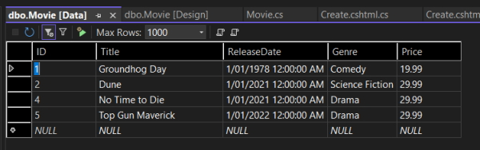
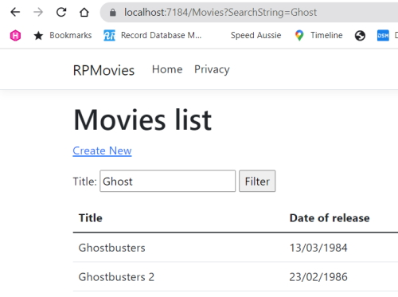

# Get started with Razor Pages in ASP.NET Core

App source code: ``Sandbox\RazorPagesMovie``

## Create an ASP.Net Core WebApp

In this process there are two checkbox options.

Configure for https: - Check this.

Do not use top-level statements: - Check this.

This option will allow you to use a Namespace and Class structure in your C# files.

This file structure is created.


You can run the application with ``CTRL-F5``.

Visual Studio:

Runs the app, which launches the [Kestrel server](https://docs.microsoft.com/en-us/aspnet/core/fundamentals/servers/kestrel?view=aspnetcore-6.0).

Launches the default browser at <https://localhost:7184/>, which displays the apps UI.

### Pages folder

Contains Razor pages and supporting files. Each Razor page is a pair of files:

A .cshtml file that has HTML markup with C# code using Razor syntax.

A .cshtml.cs file that has C# code that handles page events.

Supporting files have names that begin with an underscore. For example, the *_Layout.cshtml* file configures UI elements common to all  pages. This file sets up the navigation menu at the top of the page and the copyright notice at the bottom of the page. For more information, see [Layout in ASP.NET Core](https://docs.microsoft.com/en-us/aspnet/core/fundamentals/configuration/?view=aspnetcore-6.0).

### wwwroot folder

Contains static assets, like HTML files, JavaScript files, and CSS files. For more information, see [Static files in ASP.NET Core](https://docs.microsoft.com/en-us/aspnet/core/fundamentals/static-files?view=aspnetcore-6.0).

### appsettings.json

Contains configuration data, like connection strings. For more information, see [Configuration in ASP.NET Core](https://docs.microsoft.com/en-us/aspnet/core/fundamentals/configuration/?view=aspnetcore-6.0).

### Program.cs

Contains the following code:

```csharp
    var builder = WebApplication.CreateBuilder(args);

    // Add services to the container.
    builder.Services.AddRazorPages();

    var app = builder.Build();

    // Configure the HTTP request pipeline.
    if (!app.Environment.IsDevelopment())
    {
        app.UseExceptionHandler("/Error");
        // The default HSTS value is 30 days. You may want to change this for production scenarios, see https://aka.ms/aspnetcore-hsts.
        app.UseHsts();
    }

    app.UseHttpsRedirection();

    app.UseStaticFiles();

    app.UseRouting();

    app.UseAuthorization();

    app.MapRazorPages();

    app.Run();
```

The following lines of code in this file create a ``WebApplicationBuilder`` with preconfigured defaults, add Razor Pages support to the [Dependency Injection (DI) container](<https://docs.microsoft.com/en-us/aspnet/core/fundamentals/dependency-injection?view=aspnetcore-6.0>), and build the app:

```csharp
    var builder = WebApplication.CreateBuilder(args);

    // Add services to the container.
    builder.Services.AddRazorPages();

    var app = builder.Build();
```

The developer exception page is enabled by default and provides helpful information on exceptions. Production apps should not be run in development mode because the developer exception page can leak sensitive information.

The following code sets the exception endpoint to /Error and enables [HTTP Strict Transport Security Protocol (HSTS)](https://docs.microsoft.com/en-us/aspnet/core/security/enforcing-ssl?view=aspnetcore-6.0#http-strict-transport-security-protocol-hsts) when the app is not running in development mode:

```csharp
    // Configure the HTTP request pipeline.
    if (!app.Environment.IsDevelopment())
    {
        app.UseExceptionHandler("/Error");
        // The default HSTS value is 30 days. You may want to change this for production scenarios, see https://aka.ms/aspnetcore-hsts.
        app.UseHsts();
    }
```

For example, the preceding code runs when the app is in production or test mode. For more information, see [Use multiple environments in ASP.NET Core](https://docs.microsoft.com/en-us/aspnet/core/fundamentals/environments?view=aspnetcore-6.0).

The following code enables various Middleware:

``app.UseHttpsRedirection();`` : Redirects HTTP requests to HTTPS.

``app.UseStaticFiles();`` : Enables static files, such as HTML, CSS, images, and JavaScript to be served. For more information, see Static files in ASP.NET Core.

``app.UseRouting();`` : Adds route matching to the middleware pipeline. For more information, see Routing in ASP.NET Core

``app.MapRazorPages();Z`` : Configures endpoint routing for Razor Pages.

``app.UseAuthorization();`` : Authorizes a user to access secure resources. This app doesn't use authorization, therefore this line could be removed.

``app.Run();`` : Runs the app.

## Add a model to a Razor Pages app in ASP.NET Core

In this tutorial, classes are added for managing movies in a database. The app's model classes use [Entity Framework Core (EF Core)](https://docs.microsoft.com/en-us/ef/core) to work with the database. EF Core is an object-relational mapper (O/RM) that simplifies data access. You write the model classes first, and EF Core creates the database.

The model classes are known as **POCO** classes (from "Plain-Old CLR Objects") because they don't have a dependency on EF Core. They define the properties of the data that are stored in the database.

### Add a data model

Create a new folder on the root of your project named **Models** and add a new class named **Movie**.

```csharp
    using System.ComponentModel.DataAnnotations;

    namespace RazorPagesMovie.Models
    {
        public class Movie
        {
            public int ID { get; set; }
            public string Title { get; set; } = string.Empty;

            [DataType(DataType.Date)]
            public DateTime ReleaseDate { get; set; }
            public string Genre { get; set; } = string.Empty;
            public decimal Price { get; set; }
        }
    }
```

We are using data annotations for the **ReleaseDate** property to set the data type. By adding this the user doesn't have to enter Time information in the date field and only the date is shown, not the time information.

Build the project to make sure there are no errors.

### Scaffold the movie model

In this section, the movie model is scaffolded. That is, the scaffolding tool produces pages for Create, Read, Update, and Delete (CRUD) operations for the movie model.

1. Open NuGet package manager and browse to **Microsoft.EntityFrameworkCore.Design** and add it to your project.
2. Create the **Pages/Movies** folder.
3. Right-click on the **Pages/Movies** folder > **Add > New Scaffolded Item**.
4. In the Add New Scaffold dialog, select Razor Pages using Entity Framework (CRUD) > **Add**.


**Model class**: Movie (RazorPagesMovie.Models)
**Data context class**: RazorPagesMovie.Data.RazorPagesMovieContext

The ``appsettings.json`` file is updated with the connection string used to connect to a local database.

### Files created and updated

The scaffold process creates the following files:

Pages/Movies: Create, Delete, Details, Edit, and Index.

Data/RazorPagesMovieContext.cs

The scaffold process updates the **Program.cs** file.

#### using statements

```csharp
    using Microsoft.EntityFrameworkCore;
    using Microsoft.Extensions.DependencyInjection;
    using RazorPagesMovie.Data;
```

#### db context

```csharp
    var builder = WebApplication.CreateBuilder(args);
        
        // Adds this db context
        builder.Services.AddDbContext<RazorPagesMovieContext>(options =>
            options.UseSqlServer(builder.Configuration.GetConnectionString("RazorPagesMovieContext") ?? throw newInvalidOperationException("Connection string 'RazorPagesMovieContext' not found.")));
```

## Create the initial database schema using EF's migration feature

The migrations feature in Entity Framework Core provides a way to:

* Create the initial database schema.
* Incrementally update the database schema to keep it in sync with the app's data model. Existing data in the database is preserved.

Open the NuGet Package Manager console 

In the PMC, enter the following commands:

```powershell
    Add-Migration InitialCreate
    Update-Database
```

**Note:** the ``RazorPagesMovie.Data.mdf`` database is stored in my *Users\alanr* folder.

The preceding commands install the [Entity Framework Core](https://docs.microsoft.com/en-us/ef/core/get-started/overview/install#get-the-entity-framework-core-tools) tools and run the migrations command to generate code that creates the initial database schema.

The following warning is displayed, which is addressed in a later step:

> No type was specified for the decimal column 'Price' on entity type 'Movie'. This will cause values to be silently truncated if they do not fit in the default precision and scale. Explicitly specify the SQL server column type that can accommodate all the values using 'HasColumnType()'.

The ``migrations`` command generates code to create the initial database schema. The schema is based on the model specified in ``DbContext``. The ``InitialCreate`` argument is used to name the migrations. Any name can be used, but by convention a name is selected that describes the migration.

The ``update`` command runs the ``Up`` method in migrations that have not been applied. In this case, ``update`` runs the ``Up`` method in the ``Migrations/<time-stamp>_InitialCreate.cs`` file, which creates the database.

### Examine the context registered with dependency injection

ASP.NET Core is built with dependency injection. Services, such as the EF Core database context, are registered with [dependency injection](https://docs.microsoft.com/en-us/aspnet/core/fundamentals/dependency-injection?view=aspnetcore-6.0) during application startup. Components that require these services (such as Razor Pages) are provided via constructor parameters. The constructor code that gets a database context instance is shown later in the tutorial.

The scaffolding tool automatically created a database context and registered it with the dependency injection container. The following highlighted code is added to the ``Program.cs`` file by the scaffolder:

```csharp
    builder.Services.AddDbContext<RazorPagesMovieContext>(options =>
            options.UseSqlServer(builder.Configuration.GetConnectionString("RazorPagesMovieContext") ?? throw newInvalidOperationException("Connection string 'RazorPagesMovieContext' not found.")));
```

The data context ``RazorPagesMovieContext``:

* Derives from [Microsoft.EntityFrameworkCore.DbContext](https://docs.microsoft.com/en-us/dotnet/api/microsoft.entityframeworkcore.dbcontext).
* Specifies which entities are included in the data model.
* Coordinates EF Core functionality, such as Create, Read, Update and Delete, for the ``Movie`` model.

#### Data/RazorPagesMovieContext.cs

```csharp
    using System;
    using System.Collections.Generic;
    using System.Linq;
    using System.Threading.Tasks;
    using Microsoft.EntityFrameworkCore;
    using RazorPagesMovie.Models;

    namespace RazorPagesMovie.Data
    {
        public class RazorPagesMovieContext : DbContext
        {
            public RazorPagesMovieContext (DbContextOptions<RazorPagesMovieContext> options)
                : base(options)
            {
            }

            public DbSet<RazorPagesMovie.Models.Movie> Movie { get; set; }
        }
    }
```

The preceding code creates a [DbSet<Movie>](https://docs.microsoft.com/en-us/dotnet/api/microsoft.entityframeworkcore.dbset-1) property for the entity set. In Entity Framework terminology, an entity set typically corresponds to a database table. An entity corresponds to a row in the table.

The name of the connection string is passed in to the context by calling a method on a [DbContextOptions](https://docs.microsoft.com/en-us/dotnet/api/microsoft.entityframeworkcore.dbcontextoptions) object. For local development, the [Configuration system](https://docs.microsoft.com/en-us/aspnet/core/fundamentals/configuration/?view=aspnetcore-6.0) reads the connection string from the ``appsettings.json`` file.

## Build the App

Build the app. The compiler generates several nullable warnings. 

**Note:** In .Net 6.0 the nullable types are automatically enabled so I don't see these errors.

Fix the warning messages

In this section, you can either disable nullable warnings or fix the scaffolded code. To eliminate the warnings from nullable reference types, remove the following line from the ``RazorPagesMovie.csproj`` file:

```xml
    <Nullable>enable</Nullable>
```

Rather than do this you should fix the scaffold code.

### RazorPagesMovieContext.cs

```csharp
    public DbSet<RazorPagesMovie.Models.Movie>? Movie { get; set; }
```

We add the nullable after ``DbSet<>``. This has been done for us in .Net 6.0.

## Scaffolded Razor Pages in ASP.NET core

We now examine the Razor Pages created by scaffolding in the previous tutorial.

### Pages/Movies/Index.cshtml.cs

This is the Index page Model.

```csharp
    using Microsoft.AspNetCore.Mvc.RazorPages;
    using Microsoft.EntityFrameworkCore;
    using RazorPagesMovie.Models;

    namespace RazorPagesMovie.Pages.Movies
    {
        public class IndexModel : PageModel
        {
            private readonly RazorPagesMovie.Data.RazorPagesMovieContext _context;

            public IndexModel(RazorPagesMovie.Data.RazorPagesMovieContext context)
            {
                _context = context;
            }

            public IList<Movie> Movie { get; set; }

            public async Task OnGetAsync()
            {
                Movie = await _context.Movie.ToListAsync();
            }
        }
    }
```

Razor Pages are derived from [PageModel](https://docs.microsoft.com/en-us/dotnet/api/microsoft.aspnetcore.mvc.razorpages.pagemodel). By convention, the ``PageModel`` derived class is named ``PageNameModel``. For example, the Index page is named ``IndexModel``.

The constructor uses [dependency injection](https://docs.microsoft.com/en-us/aspnet/core/fundamentals/dependency-injection?view=aspnetcore-6.0) to add the ``RazorPagesMovieContext`` to the page:

```csharp
    public class IndexModel : PageModel
    {
        private readonly RazorPagesMovie.Data.RazorPagesMovieContext _context;

        public IndexModel(RazorPagesMovie.Data.RazorPagesMovieContext context)
        {
            _context = context;
        }
        ...
    }
```

When a request is made for the page, the ``OnGetAsync`` method returns a list of movies to the Razor Page. On a Razor Page, ``OnGetAsync`` or ``OnGet`` is called to initialize the state of the page. In this case, ``OnGetAsync`` gets a list of movies and displays them.

See [Asynchronous code](https://docs.microsoft.com/en-us/aspnet/core/data/ef-rp/intro?view=aspnetcore-6.0#asynchronous-code) for more information on asynchronous programming with Entity Framework.

When ``OnGet`` returns ``void`` or ``OnGetAsync`` returns ``Task``, no return statement is used. For example, examine the Privacy Page:

#### Privacy.cshtml.cs

```csharp
    using Microsoft.AspNetCore.Mvc;
    using Microsoft.AspNetCore.Mvc.RazorPages;

    namespace RazorPagesMovie.Pages
    {
        public class PrivacyModel : PageModel
        {
            private readonly ILogger<PrivacyModel> _logger;

            public PrivacyModel(ILogger<PrivacyModel> logger)
            {
                _logger = logger;
            }

            public void OnGet()
            {
            }
        }
    }
```

When the return type is [IActionResult](https://docs.microsoft.com/en-us/dotnet/api/microsoft.aspnetcore.mvc.iactionresult) or Task<IActionResult>, a return statement must be provided. For example, the ``Pages/Movies/Create.cshtml.cs`` ``OnPostAsync`` method:

#### Pages/Movies/Create.cshtml.cs

```csharp
    public async Task<IActionResult> OnPostAsync()
    {
        if (!ModelState.IsValid)
        {
            return Page();
        }

        _context.Movie.Add(Movie);
        await _context.SaveChangesAsync();

        return RedirectToPage("./Index");
    }
```

Examine the ``Pages/Movies/Index.cshtml`` Razor Page:

#### Pages/Movies/Index.cshtml

```csharp
    @page
    @model RazorPagesMovie.Pages.Movies.IndexModel

    @{
        ViewData["Title"] = "Index";
    }

    <h1>Index</h1>

    <p>
        <a asp-page="Create">Create New</a>
    </p>
    <table class="table">
        <thead>
            <tr>
                <th>
                    @Html.DisplayNameFor(model => model.Movie[0].Title)
                </th>
                <th>
                    @Html.DisplayNameFor(model => model.Movie[0].ReleaseDate)
                </th>
                <th>
                    @Html.DisplayNameFor(model => model.Movie[0].Genre)
                </th>
                <th>
                    @Html.DisplayNameFor(model => model.Movie[0].Price)
                </th>
                <th></th>
            </tr>
        </thead>
        <tbody>
    @foreach (var item in Model.Movie) {
            <tr>
                <td>
                    @Html.DisplayFor(modelItem => item.Title)
                </td>
                <td>
                    @Html.DisplayFor(modelItem => item.ReleaseDate)
                </td>
                <td>
                    @Html.DisplayFor(modelItem => item.Genre)
                </td>
                <td>
                    @Html.DisplayFor(modelItem => item.Price)
                </td>
                <td>
                    <a asp-page="./Edit" asp-route-id="@item.ID">Edit</a> |
                    <a asp-page="./Details" asp-route-id="@item.ID">Details</a> |
                    <a asp-page="./Delete" asp-route-id="@item.ID">Delete</a>
                </td>
            </tr>
    }
        </tbody>
    </table>
```

Razor can transition from HTML into C# or into Razor-specific markup. When an @ symbol is followed by a Razor reserved keyword, it transitions into [Razor-specific markup](https://docs.microsoft.com/en-us/aspnet/core/mvc/views/razor?view=aspnetcore-6.0#razor-reserved-keywords), otherwise it transitions into C#.

### The @page directive

The ``@page`` Razor directive makes the file an MVC action, which means that it can handle requests. ``@page`` must be the first Razor directive on a page. ``@page`` and ``@model`` are examples of transitioning into Razor-specific markup. See [Razor syntax](https://docs.microsoft.com/en-us/aspnet/core/mvc/views/razor?view=aspnetcore-6.0#razor-syntax) for more information.

### The @model directive

```csharp
    @page
    @model RazorPagesMovie.Pages.Movies.IndexModel
```

The ``@model`` directive specifies the type of the model passed to the Razor Page. In the preceding example, the ``@model`` line makes the ``PageModel`` derived class available to the Razor Page. The model is used in the ``@Html.DisplayNameFor`` and ``@Html.DisplayFor`` [HTML Helpers](https://docs.microsoft.com/en-us/aspnet/mvc/overview/older-versions-1/views/creating-custom-html-helpers-cs#understanding-html-helpers) on the page.

Examine the lambda expression used in the following HTML Helper:

```csharp
    @Html.DisplayNameFor(model => model.Movie[0].Title)
```

The [DisplayNameFor](https://docs.microsoft.com/en-us/dotnet/api/microsoft.aspnetcore.mvc.rendering.ihtmlhelper-1.displaynamefor) HTML Helper inspects the ``Title`` property referenced in the lambda expression to determine the display name. The lambda expression is inspected rather than evaluated. That means there is no access violation when ``model``, ``model.Movie``, or ``model.Movie[0]`` is null or empty. When the lambda expression is evaluated, for example, with ``@Html.DisplayFor(modelItem => item.Title)``, the model's property values are evaluated.

### The layout page

Select the menu links **RazorPagesMovie**, **Home**, and **Privacy**. Each page shows the same menu layout. The menu layout is implemented in the ``Pages/Shared/_Layout.cshtml`` file.

Open and examine the ``Pages/Shared/_Layout.cshtml`` file.

[Layout templates](https://docs.microsoft.com/en-us/aspnet/core/mvc/views/layout?view=aspnetcore-6.0) allow the HTML container layout to be:

* Specified in one place.
* Applied in multiple pages in the site.

Find the ``@RenderBody()`` line. ``RenderBody`` is a placeholder where all the page-specific views show up, *wrapped* in the layout page. For example, select the Privacy link and the ``Pages/Privacy.cshtml`` view is rendered inside the ``RenderBody`` method.

### ViewData and layout

Consider the following markup from the ``Pages/Movies/Index.cshtml`` file:

```csharp
    @page
    @model RazorPagesMovie.Pages.Movies.IndexModel

    @{
        ViewData["Title"] = "Index";
    }
```

The preceding highlighted markup is an example of Razor transitioning into C#. The ``{`` and ``}`` characters enclose a block of C# code.

The ``PageModel`` base class contains a ``ViewData`` dictionary property that can be used to pass data to a View. Objects are added to the ``ViewData`` dictionary using a **key value** pattern. In the preceding sample, the Title property is added to the ``ViewData`` dictionary.

## Update the layout

The ``Title`` property is used in the ``Pages/Shared/_Layout.cshtml`` file. The following markup shows the first few lines of the ``_Layout.cshtml`` file.

```html
    <!DOCTYPE html>
    <html lang="en">
        <head>
            <meta charset="utf-8" />
        <meta name="viewport" content="width=device-width, initial-scale=1.0" />
        <title>@ViewData["Title"] - Movie</title>
        <link rel="stylesheet" href="~/lib/bootstrap/dist/css/bootstrap.css" />
```

Find the following anchor element in the ``Pages/Shared/_Layout.cshtml`` file.

```csharp
    <a class="navbar-brand" asp-area="" asp-page="/Index">RazorPagesMovie</a>
```

Change to.

```csharp
    <a class="navbar-brand" asp-page="/Movies/Index">RpMovie</a>
```

When you click on this link.


The preceding anchor element is a [Tag Helper](https://docs.microsoft.com/en-us/aspnet/core/mvc/views/tag-helpers/intro?view=aspnetcore-6.0). In this case, it's the [Anchor Tag Helper](https://docs.microsoft.com/en-us/aspnet/core/mvc/views/tag-helpers/built-in/anchor-tag-helper?view=aspnetcore-6.0). The ``asp-page="/Movies/Index"`` Tag Helper attribute and value creates a link to the ``/Movies/Index Razor Page``. The ``asp-area`` attribute value is empty, so the area isn't used in the link. See [Areas](https://docs.microsoft.com/en-us/aspnet/core/mvc/controllers/areas?view=aspnetcore-6.0) for more information.

The ``Layout`` property is set in the ``Pages/_ViewStart.cshtml`` file:

```csharp
    @{
        Layout = "_Layout";
    }
```

The preceding markup sets the layout file to ``Pages/Shared/_Layout.cshtml`` for all Razor files under the *Pages* folder. See [Layout](https://docs.microsoft.com/en-us/aspnet/core/razor-pages/?view=aspnetcore-6.0#layout) for more information.

## The Create page model

Examine the ``Pages/Movies/Create.cshtml.cs`` page model:

### Create.cshtml.cs

```csharp
    using System;
    using System.Collections.Generic;
    using System.Linq;
    using System.Threading.Tasks;
    using Microsoft.AspNetCore.Mvc;
    using Microsoft.AspNetCore.Mvc.RazorPages;
    using Microsoft.AspNetCore.Mvc.Rendering;
    using RazorPagesMovie.Data;
    using RazorPagesMovie.Models;

    namespace RazorPagesMovie.Pages.Movies
    {
        public class CreateModel : PageModel
        {
            private readonly RazorPagesMovie.Data.RazorPagesMovieContext _context;

            public CreateModel(RazorPagesMovie.Data.RazorPagesMovieContext context)
            {
                _context = context;
            }

            public IActionResult OnGet()
            {
                return Page();
            }

            [BindProperty]
            public Movie Movie { get; set; } = default!;


            // To protect from overposting attacks, see https://aka.ms/RazorPagesCRUD
            public async Task<IActionResult> OnPostAsync()
            {
              if (!ModelState.IsValid || _context.Movie == null || Movie == null)
                {
                    return Page();
                }

                _context.Movie.Add(Movie);
                await _context.SaveChangesAsync();

                return RedirectToPage("./Index");
            }
        }
    }
```

The ``OnGet`` method initializes any state needed for the page. The Create page doesn't have any state to initialize, so ``Page`` is returned. Later in the tutorial, an example of ``OnGet`` initializing state is shown. The ``Page`` method creates a ``PageResult`` object that renders the ``Create.cshtml`` page.

The ``Movie`` property uses the [[BindProperty]](https://docs.microsoft.com/en-us/dotnet/api/microsoft.aspnetcore.mvc.bindpropertyattribute) attribute to opt-in to [model binding](https://docs.microsoft.com/en-us/aspnet/core/mvc/models/model-binding?view=aspnetcore-6.0). When the Create form posts the form values, the ASP.NET Core runtime binds the posted values to the ``Movie`` model.

The ``OnPostAsync`` method is run when the page posts form data:

```csharp
    public async Task<IActionResult> OnPostAsync()
    {
      if (!ModelState.IsValid || _context.Movie == null || Movie == null)
        {
            return Page();
        }
        _context.Movie.Add(Movie);
        await _context.SaveChangesAsync();
        return RedirectToPage("./Index");
    }
```

If there are any model errors, the form is redisplayed, along with any form data posted. Most model errors can be caught on the client-side before the form is posted. An example of a model error is posting a value for the date field that cannot be converted to a date. Client-side validation and model validation are discussed later in the tutorial.

If there are no model errors:

* The data is saved.
* The browser is redirected to the Index page.

## The Create Razor Page

### Pages/Movies/Create.cshtml

```csharp
    @page
    @model RazorPagesMovie.Pages.Movies.CreateModel

    @{
        ViewData["Title"] = "Create";
    }

    <h1>Create</h1>

    <h4>Movie</h4>
    <hr />
    <div class="row">
        <div class="col-md-4">
            <form method="post">
                <div asp-validation-summary="ModelOnly" class="text-danger"></div>
                <div class="form-group">
                    <label asp-for="Movie.Title" class="control-label"></label>
                    <input asp-for="Movie.Title" class="form-control" />
                    <span asp-validation-for="Movie.Title" class="text-danger"></span>
                </div>
                <div class="form-group">
                    <label asp-for="Movie.ReleaseDate" class="control-label"></label>
                    <input asp-for="Movie.ReleaseDate" class="form-control" />
                    <span asp-validation-for="Movie.ReleaseDate" class="text-danger"></span>
                </div>
                <div class="form-group">
                    <label asp-for="Movie.Genre" class="control-label"></label>
                    <input asp-for="Movie.Genre" class="form-control" />
                    <span asp-validation-for="Movie.Genre" class="text-danger"></span>
                </div>
                <div class="form-group">
                    <label asp-for="Movie.Price" class="control-label"></label>
                    <input asp-for="Movie.Price" class="form-control" />
                    <span asp-validation-for="Movie.Price" class="text-danger"></span>
                </div>
                <div class="form-group">
                    <input type="submit" value="Create" class="btn btn-primary" />
                </div>
            </form>
        </div>
    </div>

    <div>
        <a asp-page="Index">Back to List</a>
    </div>

    @section Scripts {
        @{await Html.RenderPartialAsync("_ValidationScriptsPartial");}
    }
```

Visual Studio displays the following tags in a distinctive bold font used for Tag Helpers:

* ``<form method="post">``
* ``<div asp-validation-summary="ModelOnly" class="text-danger"></div>``
* ``<label asp-for="Movie.Title" class="control-label"></label>``
* ``<input asp-for="Movie.Title" class="form-control" />``
* ``<span asp-validation-for="Movie.Title" class="text-danger"></span>``

The ``<form method="post">`` element is a [Form Tag Helper](https://docs.microsoft.com/en-us/aspnet/core/mvc/views/working-with-forms?view=aspnetcore-6.0#the-form-tag-helper). The Form Tag Helper automatically includes an [antiforgery token](https://docs.microsoft.com/en-us/aspnet/core/security/anti-request-forgery?view=aspnetcore-6.0).

The scaffolding engine creates Razor markup for each field in the model, except the ID, similar to the following:

```html
    <div asp-validation-summary="ModelOnly" class="text-danger"></div>
    <div class="form-group">
        <label asp-for="Movie.Title" class="control-label"></label>
        <input asp-for="Movie.Title" class="form-control" />
        <span asp-validation-for="Movie.Title" class="text-danger"></span>
    </div>
```

The [Validation Tag Helpers](https://docs.microsoft.com/en-us/aspnet/core/mvc/views/working-with-forms?view=aspnetcore-6.0#the-validation-tag-helpers) (``<div asp-validation-summary`` and ``<span asp-validation-for``) display validation errors. Validation is covered in more detail later in this series.

The [Label Tag Helper](https://docs.microsoft.com/en-us/aspnet/core/mvc/views/working-with-forms?view=aspnetcore-6.0#the-label-tag-helper) (``<label asp-for="Movie.Title" class="control-label"></label>``) generates the label caption and ``[for]`` attribute for the ``Title`` property.

The [Input Tag Helper](https://docs.microsoft.com/en-us/aspnet/core/mvc/views/working-with-forms?view=aspnetcore-6.0) (``<input asp-for="Movie.Title" class="form-control">``) uses the [DataAnnotations](https://docs.microsoft.com/en-us/aspnet/mvc/overview/older-versions/mvc-music-store/mvc-music-store-part-6) attributes and produces HTML attributes needed for jQuery Validation on the client-side.

For more information on Tag Helpers such as ``<form method="post">``, see [Tag Helpers in ASP.NET Core](https://docs.microsoft.com/en-us/aspnet/core/mvc/views/tag-helpers/intro?view=aspnetcore-6.0).

## Working with a database

The ``RazorPagesMovieContext`` object handles the task of connecting to the database and mapping ``Movie`` objects to database records. The database context is registered with the [Dependency Injection](https://docs.microsoft.com/en-us/aspnet/core/fundamentals/dependency-injection?view=aspnetcore-6.0) container in ``Program.cs``:

### Program.cs

```csharp
    using Microsoft.EntityFrameworkCore;
    using Microsoft.Extensions.DependencyInjection;
    using RazorPagesMovie.Data;
    var builder = WebApplication.CreateBuilder(args);

    // Add services to the container.
    builder.Services.AddRazorPages();

    builder.Services.AddDbContext<RazorPagesMovieContext>(options => 
           options.UseSqlServer(builder.Configuration.GetConnectionString("RazorPagesMovieContext")));

    var app = builder.Build();
```

The ASP.NET Core Configuration system reads the ``ConnectionString`` key. For local development, configuration gets the connection string from the ``appsettings.json`` file.

```json
    {
      "Logging": {
        "LogLevel": {
          "Default": "Information",
          "Microsoft": "Warning",
          "Microsoft.Hosting.Lifetime": "Information"
        }
      },
      "AllowedHosts": "*",
      "ConnectionStrings": {
        "RazorPagesMovieContext": "Server=(localdb)\\mssqllocaldb;Database=RazorPagesMovieContext-bc;Trusted_Connection=True;   MultipleActiveResultSets=true"
      }
    }
```

When the app is deployed to a test or production server, an environment variable can be used to set the connection string to a test or production database server. For more information, see [Configuration](https://docs.microsoft.com/en-us/aspnet/core/fundamentals/configuration/?view=aspnetcore-6.0).

### SQL Server Express LocalDB

LocalDB is a lightweight version of the SQL Server Express database engine that's targeted for program development. LocalDB starts on demand and runs in user mode, so there's no complex configuration. By default, LocalDB database creates ``*.mdf`` files in the ``C:\Users\<user>\`` directory.

From the **View** menu, open **SQL Server Object Explorer (SSOX)**.


Right-Click on the ``Movie`` table and click on *View Designer*.


**Note:** the key icon next to ``ID``. By default, EF creates a property named ``ID`` for the primary key.

Clicking on *View Data* will show you a grid of your data.



### Seed the database

Create a new class named ``SeedData`` in the Models folder with the following code:

```csharp
    using Microsoft.EntityFrameworkCore;
    using RazorPagesMovie.Data;

    namespace RazorPagesMovie.Models
    {
        public static class SeedData
        {
            public static void Initialize(IServiceProvider serviceProvider)
            {
                using (var context = new RazorPagesMovieContext(
                    serviceProvider.GetRequiredService<
                        DbContextOptions<RazorPagesMovieContext>>()))
                {
                    if (context == null || context.Movie == null)
                    {
                        throw new ArgumentNullException("Null RazorPagesMovieContext");
                    }

                    // Look for any movies.
                    if (context.Movie.Any())
                    {
                        return;   // DB has been seeded
                    }

                    context.Movie.AddRange(
                        new Movie
                        {
                            Title = "When Harry Met Sally",
                            ReleaseDate = DateTime.Parse("1989-2-12"),
                            Genre = "Romantic Comedy",
                            Price = 7.99M
                        },

                        new Movie
                        {
                            Title = "Ghostbusters ",
                            ReleaseDate = DateTime.Parse("1984-3-13"),
                            Genre = "Comedy",
                            Price = 8.99M
                        },

                        new Movie
                        {
                            Title = "Ghostbusters 2",
                            ReleaseDate = DateTime.Parse("1986-2-23"),
                            Genre = "Comedy",
                            Price = 9.99M
                        },

                        new Movie
                        {
                            Title = "Rio Bravo",
                            ReleaseDate = DateTime.Parse("1959-4-15"),
                            Genre = "Western",
                            Price = 3.99M
                        }
                    );
                    context.SaveChanges();
                }
            }
        }
    }
```

If there are any movies in the database, the seed initializer returns and no movies are added.

```csharp
    if (context.Movie.Any())
    {
        return;
    }
```

### Add the seed initializer

Update the ``Program.cs`` with the following highlighted code:

```csharp
    using Microsoft.EntityFrameworkCore;
    using RazorPagesMovie.Data;
    using RazorPagesMovie.Models;

    var builder = WebApplication.CreateBuilder(args);

    builder.Services.AddRazorPages();

    builder.Services.AddDbContext<RazorPagesMovieContext>(options =>
           options.UseSqlServer(builder.Configuration.GetConnectionString("RazorPagesMovieContext")));

    var app = builder.Build();

    using (var scope = app.Services.CreateScope())
    {
        var services = scope.ServiceProvider;

        SeedData.Initialize(services);
    }

    if (!app.Environment.IsDevelopment())
    {
        app.UseExceptionHandler("/Error");
        app.UseHsts();
    }

    app.UseHttpsRedirection();
    app.UseStaticFiles();

    app.UseRouting();

    app.UseAuthorization();

    app.MapRazorPages();

    app.Run();
```

In the previous code, ``Program.cs`` has been modified to do the following:

Get a database context instance from the dependency injection (DI) container.

Call the ``seedData.Initialize`` method, passing to it the database context instance.

Dispose the context when the seed method completes. The [using statement](https://docs.microsoft.com/en-us/dotnet/csharp/language-reference/keywords/using-statement) ensures the context is disposed.

The following exception occurs when ``Update-Database`` has not been run:

> SqlException: Cannot open database "RazorPagesMovieContext-" requested by the login. The login failed. Login failed for user 'user name'.

### Test the app

Delete all the records in the database so the seed method will run. Stop and start the app to seed the database. If the database isn't seeded, put a breakpoint on ``if (context.Movie.Any())`` and step through the code.

The app shows the seeded data:


## Update the generated pages

The scaffolded movie app has a good start, but the presentation isn't ideal. Change **ReleaseDate** to, **Date of release**.

### Models/Movie.cs

```csharp
    using System.ComponentModel;
    using System.ComponentModel.DataAnnotations;
    using System.ComponentModel.DataAnnotations.Schema;

    namespace RazorPagesMovie.Models
    {
        public class Movie
        {
            public int ID { get; set; }
            public string Title { get; set; } = string.Empty;

            [DisplayName("Date of release")]
            [DataType(DataType.Date)]
            public DateTime ReleaseDate { get; set; }
            public string Genre { get; set; } = string.Empty;

            [Column(TypeName = "decimal(18, 2)")]
            public decimal Price { get; set; }
        }
    }
```

The ``[Column(TypeName = "decimal(18, 2)")]`` data annotation enables Entity Framework Core to correctly map ``Price`` to currency in the database. For more information, see [Data Types](https://docs.microsoft.com/en-us/ef/core/modeling/relational/data-types).

* The [[Display](https://docs.microsoft.com/en-us/dotnet/api/system.componentmodel.dataannotations.displayattribute)] attribute specifies the display name of a field. In the preceding code, "Date of release" instead of "ReleaseDate".
* The [[DataType](https://docs.microsoft.com/en-us/dotnet/api/system.componentmodel.dataannotations.datatypeattribute)] attribute specifies the type of the data (Date). The time information stored in the field isn't displayed.

[DataAnnotations](https://docs.microsoft.com/en-us/aspnet/mvc/overview/older-versions/mvc-music-store/mvc-music-store-part-6) is covered in the next tutorial.

Browse to ``Pages/Movies`` and hover over an Edit link to see the target URL.


The **Edit**, **Details**, and **Delete** links are generated by the [Anchor Tag Helper](https://docs.microsoft.com/en-us/aspnet/core/mvc/views/tag-helpers/built-in/anchor-tag-helper?view=aspnetcore-6.0) in the ``Pages/Movies/Index.cshtml`` file.

### Pages/Movies/Index.cshtml

```csharp
    @foreach (var item in Model.Movie) {
            <tr>
                <td>
                    @Html.DisplayFor(modelItem => item.Title)
                </td>
                <td>
                    @Html.DisplayFor(modelItem => item.ReleaseDate)
                </td>
                <td>
                    @Html.DisplayFor(modelItem => item.Genre)
                </td>
                <td>
                    @Html.DisplayFor(modelItem => item.Price)
                </td>
                <td>
                    <a asp-page="./Edit" asp-route-id="@item.ID">Edit</a> |
                    <a asp-page="./Details" asp-route-id="@item.ID">Details</a> |
                    <a asp-page="./Delete" asp-route-id="@item.ID">Delete</a>
                </td>
            </tr>
    }
        </tbody>
    </table>
```

[Tag Helpers](https://docs.microsoft.com/en-us/aspnet/core/mvc/views/tag-helpers/intro?view=aspnetcore-6.0) enable server-side code to participate in creating and rendering HTML elements in Razor files.

In the preceding code, the [Anchor Tag Helper](https://docs.microsoft.com/en-us/aspnet/core/mvc/views/tag-helpers/built-in/anchor-tag-helper?view=aspnetcore-6.0) dynamically generates the HTML ``href`` attribute value from the Razor Page (the route is relative), the ``asp-page``, and the route identifier (``asp-route-id``). For more information, see [URL generation for Pages](https://docs.microsoft.com/en-us/aspnet/core/razor-pages/?view=aspnetcore-6.0#url-generation-for-pages).

Use **View Source** from a browser to examine the generated markup. A portion of the generated HTML is shown below:

```html
    <td>
      <a href="/Movies/Edit?id=1">Edit</a> |
      <a href="/Movies/Details?id=1">Details</a> |
      <a href="/Movies/Delete?id=1">Delete</a>
    </td>
```

The dynamically generated links pass the movie ID with a query string. For example, the ``?id=1`` in ``https://localhost:5001/Movies/Details?id=1``.

### Add route template

Update the Edit, Details, and Delete Razor Pages to use the ``{id:int}`` route template. Change the page directive for each of these pages from ``@page`` to ``@page "{id:int}"``. Run the app and then view source.

The generated HTML adds the ID to the path portion of the URL:

```html
    <td>
      <a href="/Movies/Edit/1">Edit</a> |
      <a href="/Movies/Details/1">Details</a> |
      <a href="/Movies/Delete/1">Delete</a>
    </td>
```

A request to the page with the ``{id:int}`` route template that does not include the integer will return an HTTP 404 (not found) error. For example, ``https://localhost:5001/Movies/Details`` will return a 404 error. To make the ID optional, append ``?`` to the route constraint:

```csharp
    @page "{id:int?}"
```

### Test the behavior of ``@page "{id:int?}"``

1. Set the page directive in ``Pages/Movies/Details.cshtml`` to``@page "{id:int?}"``.
2. Set a break point in public async ``Task<IActionResult> OnGetAsync(int? id)``, in ``Pages/Movies/Details.cshtml.cs``.
3. Navigate to ``<https://localhost:5001/Movies/Details/>``.

With the ``@page "{id:int}"`` directive, the break point is never hit. The routing engine returns HTTP 404. Using ``@page "{id:int?}"``, the ``OnGetAsync`` method returns ``NotFound`` (HTTP 404):

```csharp
    public async Task<IActionResult> OnGetAsync(int? id)
    {
        if (id == null)
        {
            return NotFound();
        }

        Movie = await _context.Movie.FirstOrDefaultAsync(m => m.ID == id);

        if (Movie == null)
        {
            return NotFound();
        }
        return Page();
    }
```

### Review concurrency exception handling

Review the ``OnPostAsync`` method in the ``Pages/Movies/Edit.cshtml.cs`` file:

```csharp
    public async Task<IActionResult> OnPostAsync()
    {
        if (!ModelState.IsValid)
        {
            return Page();
        }

        _context.Attach(Movie).State = EntityState.Modified;
        
        try
        {
            await _context.SaveChangesAsync();
        }
        catch (DbUpdateConcurrencyException)
        {
            if (!MovieExists(Movie.ID))
            {
                return NotFound();
            }
            else
            {
                throw;
            }
        }
        
        return RedirectToPage("./Index");
    }
```

The previous code detects concurrency exceptions when one client deletes the movie and the other client posts changes to the movie.

To test the ``catch`` block:

1. Set a breakpoint on ``catch (DbUpdateConcurrencyException)``.
2. Select **Edit** for a movie, make changes, but don't enter **Save**.
3. In another browser window, select the **Delete** link for the same movie, and then delete the movie.
4. In the previous browser window, post changes to the movie.

Production code may want to detect concurrency conflicts. See [Handle concurrency conflicts](https://docs.microsoft.com/en-us/aspnet/core/data/ef-rp/concurrency?view=aspnetcore-6.0) for more information.

### Posting and binding review

Examine the ``Pages/Movies/Edit.cshtml.cs`` file:

#### Edit.cshtml.cs

```csharp
    public class EditModel : PageModel
    {
        private readonly RazorPagesMovie.Data.RazorPagesMovieContext _context;

        public EditModel(RazorPagesMovie.Data.RazorPagesMovieContext context)
        {
            _context = context;
        }

        [BindProperty]
        public Movie Movie { get; set; } = default!;

        public async Task<IActionResult> OnGetAsync(int? id)
        {
            if (id == null || _context.Movie == null)
            {
                return NotFound();
            }

            var movie =  await _context.Movie.FirstOrDefaultAsync(m => m.ID == id);
            if (movie == null)
            {
                return NotFound();
            }
            Movie = movie;
            return Page();
        }

        // To protect from overposting attacks, enable the specific properties you want to bind to.
        // For more details, see https://aka.ms/RazorPagesCRUD.
        public async Task<IActionResult> OnPostAsync()
        {
            if (!ModelState.IsValid)
            {
                return Page();
            }

            _context.Attach(Movie).State = EntityState.Modified;

            try
            {
                await _context.SaveChangesAsync();
            }
            catch (DbUpdateConcurrencyException)
            {
                if (!MovieExists(Movie.ID))
                {
                    return NotFound();
                }
                else
                {
                    throw;
                }
            }

            return RedirectToPage("./Index");
        }

        private bool MovieExists(int id)
        {
          return (_context.Movie?.Any(e => e.ID == id)).GetValueOrDefault();
        }
    }
```

When an HTTP GET request is made to the Movies/Edit page, for example, ``https://localhost:5001/Movies/Edit/3``:

* The ``OnGetAsync`` method fetches the movie from the database and returns the ``Page`` method.
* The ``Page`` method renders the ``Pages/Movies/Edit.cshtml`` Razor Page. The ``Pages/Movies/Edit.cshtml`` file contains the model directive ``@model RazorPagesMovie.Pages.Movies.EditModel``, which makes the movie model available on the page.
* The Edit form is displayed with the values from the movie.

When the Movies/Edit page is posted:

* The form values on the page are bound to the ``Movie`` property. The ``[BindProperty]`` attribute enables [Model binding](https://docs.microsoft.com/en-us/aspnet/core/mvc/models/model-binding?view=aspnetcore-6.0).

```csharp
    [BindProperty]
    public Movie Movie { get; set; }
```

* If there are errors in the model state, for example, ``ReleaseDate`` cannot be converted to a date, the form is redisplayed with the submitted values.
* If there are no model errors, the movie is saved.

The HTTP GET methods in the Index, Create, and Delete Razor pages follow a similar pattern. The HTTP POST ``OnPostAsync`` method in the Create Razor Page follows a similar pattern to the ``OnPostAsync`` method in the Edit Razor Page.

## Add search to ASP.NET Core Razor Pages

In the following sections, searching movies by ``genre`` or ``name`` is added.

Add the following highlighted code to ``Pages/Movies/Index.cshtml.cs``:

```csharp
    using Microsoft.AspNetCore.Mvc.Rendering;
```

And.

```csharp
    public IList<Movie> Movie { get; set; }
    [BindProperty(SupportsGet = true)]
    public string SearchString { get; set; }
    public SelectList Genres { get; set; }
    [BindProperty(SupportsGet = true)]
    public string MovieGenre { get; set; }
```

In the previous code:

* ``SearchString``: Contains the text users enter in the search text box. ``SearchString`` has the [[BindProperty](https://docs.microsoft.com/en-us/dotnet/api/microsoft.aspnetcore.mvc.bindpropertyattribute)] attribute. ``[BindProperty]`` binds form values and query strings with the same name as the property. ``[BindProperty(SupportsGet = true)]`` is required for binding on HTTP GET requests.
* ``Genres``: Contains the list of genres. ``Genres`` allows the user to select a genre from the list. ``SelectList`` requires using ``Microsoft.AspNetCore.Mvc.Rendering``;
* ``MovieGenre``: Contains the specific genre the user selects. For example, "Western".
* ``Genres`` and ``MovieGenre`` are used later in this tutorial.

> **Warning**
> 
> For security reasons, you must opt in to binding ``GET`` request data to page model properties. Verify user input before mapping it to  properties. Opting into ``GET`` binding is useful when addressing scenarios that rely on query string or route values.
> 
> To bind a property on ``GET`` requests, set the ``[BindProperty]`` attribute's ``SupportsGet`` property to true:

```csharp
    [BindProperty(SupportsGet = true)]
```

> For more information, see [ASP.NET Core Community Standup: Bind on GET discussion](For more information, see ASP.NET Core Community Standup: Bind on GET discussion (YouTube)) (YouTube)

Update the Index page's ``OnGetAsync`` method with the following code:

```csharp
    public async Task OnGetAsync()
    {
        var movies = from m in _context.Movie
                     select m;

        if (!string.IsNullOrEmpty(SearchString))
        {
            movies = movies.Where(s => s.Title.Contains(SearchString));
        }

        Movie = await movies.ToListAsync();
    }
```

The first line of the ``OnGetAsync`` method creates a LINQ query to select the movies:

```csharp
    // using System.Linq;
    var movies = from m in _context.Movie
                 select m;
```

The query is only **defined** at this point, it has **not** been run against the database.

If the ``SearchString`` property is not null or empty, the movies query is modified to filter on the search string:

```csharp
    if (!string.IsNullOrEmpty(SearchString))
    {
        movies = movies.Where(s => s.Title.Contains(SearchString));
    }
```

The ``s => s.Title.Contains()`` code is a [Lambda Expression](https://docs.microsoft.com/en-us/dotnet/csharp/programming-guide/statements-expressions-operators/lambda-expressions). Lambdas are used in method-based [LINQ](https://docs.microsoft.com/en-us/dotnet/csharp/programming-guide/concepts/linq/) queries as arguments to standard query operator methods such as the [Where](https://docs.microsoft.com/en-us/dotnet/csharp/programming-guide/concepts/linq/query-syntax-and-method-syntax-in-linq) method or ``Contains``. LINQ queries are not executed when they're defined or when they're modified by calling a method, such as ``Where``, ``Contains``, or ``OrderBy``. Rather, query execution is deferred. The evaluation of an expression is delayed until its realized value is iterated over or the ``ToListAsync`` method is called. See [Query Execution](https://docs.microsoft.com/en-us/dotnet/framework/data/adonet/ef/language-reference/query-execution) for more information.

> Note
>
> The **Contains** method is run on the database, not in the C# code. The case sensitivity on the query depends on the database and the collation. On SQL Server, ``Contains`` maps to **SQL LIKE**, which is case insensitive. SQLite with the default collation is a mixture of case sensitive and case ***IN***sensitive, depending on the query. For information on making case insensitive SQLite queries, see the following:

* [This GitHub issue](https://github.com/dotnet/efcore/issues/11414)
* [This GitHub issue](https://github.com/dotnet/AspNetCore.Docs/issues/22314)
* [Collations and Case Sensitivity](https://docs.microsoft.com/en-us/ef/core/miscellaneous/collations-and-case-sensitivity)

Navigate to the Movies page and append a query string such as ``?searchString=Ghost`` to the URL. For example, ``https://localhost:5001/Movies?searchString=Ghost``. The filtered movies are displayed.


If the following route template is added to the Index page, the search string can be passed as a URL segment. For example, ``https://localhost:5001/Movies/Ghost``.

```csharp
    @page "{searchString?}"
```

The preceding route constraint allows searching the title as route data (a URL segment) instead of as a query string value. The ``?`` in ``"{searchString?}"`` means this is an optional route parameter.


The ASP.NET Core runtime uses model binding to set the value of the ``SearchString`` property from the query string (``?searchString=Ghost``) or route data (``https://localhost:5001/Movies/Ghost``). Model binding is ***not*** case sensitive.

However, users cannot be expected to modify the URL to search for a movie. In this step, UI is added to filter movies. If you added the route constraint "{searchString?}", remove it.

Open the ``Pages/Movies/Index.cshtml`` file, and add the ``form`` markup:

```csharp
    <p>
        <a asp-page="Create">Create New</a>
    </p>

    <form>
        <p>
            Title: <input type="text" asp-for="SearchString" />
            <input type="submit" value="Filter" />
        </p>
    </form>

    <table class="table">
```

The HTML ``<form>`` tag uses the following [Tag Helpers](https://docs.microsoft.com/en-us/aspnet/core/mvc/views/tag-helpers/intro?view=aspnetcore-6.0):

* [Form Tag Helper](https://docs.microsoft.com/en-us/aspnet/core/mvc/views/working-with-forms?view=aspnetcore-6.0#the-form-tag-helper). When the form is submitted, the filter string is sent to the Pages/Movies/Index page via query string.
* [Input Tag Helper](https://docs.microsoft.com/en-us/aspnet/core/mvc/views/working-with-forms?view=aspnetcore-6.0#the-input-tag-helper)

Save the changes and test the filter.



## Search by genre

Update the Index page's ``OnGetAsync`` method with the following code:

```csharp
    public async Task OnGetAsync()
    {
        // Use LINQ to get list of genres.
        IQueryable<string> genreQuery = from m in _context.Movie
                                        orderby m.Genre
                                        select m.Genre;

        var movies = from m in _context.Movie
                     select m;

        if (!string.IsNullOrEmpty(SearchString))
        {
            movies = movies.Where(s => s.Title.Contains(SearchString));
        }

        if (!string.IsNullOrEmpty(MovieGenre))
        {
            movies = movies.Where(x => x.Genre == MovieGenre);
        }
        Genres = new SelectList(await genreQuery.Distinct().ToListAsync());
        Movie = await movies.ToListAsync();
    }
```

The following code is a LINQ query that retrieves all the genres from the database.

```csharp
    // Use LINQ to get list of genres.
    IQueryable<string> genreQuery = from m in _context.Movie
                                    orderby m.Genre
                                    select m.Genre;
```

The ``SelectList`` of genres is created by projecting the distinct genres.

```csharp
    Genres = new SelectList(await genreQuery.Distinct().ToListAsync());
```

### Add search by genre to the Razor Page

Update the ``Index.cshtml`` [<form> element](https://developer.mozilla.org/docs/Web/HTML/Element/form) as highlighted in the following markup:

```csharp
    <form>
        <p>
            <select asp-for="MovieGenre" asp-items="Model.Genres">
                <option value="">All</option>
            </select>
            Title: <input type="text" asp-for="SearchString" />
            <input type="submit" value="Filter" />
        </p>
    </form>
```

Test the app by searching by ``genre``, by ``movie title``, and by both.


## add a new field to a Razor Page in ASP.NET Core

In this section [Entity Framework](https://docs.microsoft.com/en-us/ef/core/get-started/aspnetcore/new-db) Code First Migrations is used to:

* Add a new field to the model.
* Migrate the new field schema change to the database.

When using EF Code First to automatically create and track a database, Code First:

* Adds an [__EFMigrationsHistory](https://docs.microsoft.com/en-us/ef/core/managing-schemas/migrations/history-table) table to the database to track whether the schema of the database is in sync with the model classes it was generated from.
* Throws an exception if the model classes aren't in sync with the database.

Automatic verification that the schema and model are in sync makes it easier to find inconsistent database code issues.

### Adding a Rating Property to the Movie Model

1. Open the ``Models/Movie.cs`` file and add a ``Rating`` property:

```csharp
    public class Movie
    {
        public int ID { get; set; }
        public string Title { get; set; } = string.Empty;

        [Display(Name = "Release Date")]
        [DataType(DataType.Date)]
        public DateTime ReleaseDate { get; set; }
        public string Genre { get; set; } = string.Empty;

        [Column(TypeName = "decimal(18, 2)")]
        public decimal Price { get; set; }
        public string Rating { get; set; } = string.Empty;
    }
```

2. Edit ``Pages/Movies/Index.cshtml``, and add a ``Rating`` field:

```csharp
    @page
    @model RazorPagesMovie.Pages.Movies.IndexModel

    @{
        ViewData["Title"] = "Index";
    }

    <h1>Index</h1>

    <p>
        <a asp-page="Create">Create New</a>
    </p>

    <form>
        <p>
            <select asp-for="MovieGenre" asp-items="Model.Genres">
                <option value="">All</option>
            </select>
            Title: <input type="text" asp-for="SearchString" />
            <input type="submit" value="Filter" />
        </p>
    </form>

    <table class="table">

        <thead>
            <tr>
                <th>
                    @Html.DisplayNameFor(model => model.Movie[0].Title)
                </th>
                <th>
                    @Html.DisplayNameFor(model => model.Movie[0].ReleaseDate)
                </th>
                <th>
                    @Html.DisplayNameFor(model => model.Movie[0].Genre)
                </th>
                <th>
                    @Html.DisplayNameFor(model => model.Movie[0].Price)
                </th>
                <th>
                    @Html.DisplayNameFor(model => model.Movie[0].Rating)
                </th>
                <th></th>
            </tr>
        </thead>
        <tbody>
            @foreach (var item in Model.Movie)
            {
                <tr>
                    <td>
                        @Html.DisplayFor(modelItem => item.Title)
                    </td>
                    <td>
                        @Html.DisplayFor(modelItem => item.ReleaseDate)
                    </td>
                    <td>
                        @Html.DisplayFor(modelItem => item.Genre)
                    </td>
                    <td>
                        @Html.DisplayFor(modelItem => item.Price)
                    </td>
                    <td>
                        @Html.DisplayFor(modelItem => item.Rating)
                    </td>
                    <td>
                        @Html.DisplayFor(modelItem => item.Rating)
                    </td>                    
                    <td>
                        <a asp-page="./Edit" asp-route-id="@item.ID">Edit</a> |
                        <a asp-page="./Details" asp-route-id="@item.ID">Details</a> |
                        <a asp-page="./Delete" asp-route-id="@item.ID">Delete</a>
                    </td>
                </tr>
            }
        </tbody>
    </table>
```

3. Update the following pages with a Rating field:

#### Pages/Movies/Create.cshtml

```csharp
@page
@model RazorPagesMovie.Pages.Movies.CreateModel

@{
    ViewData["Title"] = "Create";
}

<h1>Create</h1>

<h4>Movie</h4>
<hr />
<div class="row">
    <div class="col-md-4">
        <form method="post">
            <div asp-validation-summary="ModelOnly" class="text-danger"></div>
            <div class="form-group">
                <label asp-for="Movie.Title" class="control-label"></label>
                <input asp-for="Movie.Title" class="form-control" />
                <span asp-validation-for="Movie.Title" class="text-danger"></span>
            </div>
            <div class="form-group">
                <label asp-for="Movie.ReleaseDate" class="control-label"></label>
                <input asp-for="Movie.ReleaseDate" class="form-control" />
                <span asp-validation-for="Movie.ReleaseDate" class="text-danger"></span>
            </div>
            <div class="form-group">
                <label asp-for="Movie.Genre" class="control-label"></label>
                <input asp-for="Movie.Genre" class="form-control" />
                <span asp-validation-for="Movie.Genre" class="text-danger"></span>
            </div>
            <div class="form-group">
                <label asp-for="Movie.Price" class="control-label"></label>
                <input asp-for="Movie.Price" class="form-control" />
                <span asp-validation-for="Movie.Price" class="text-danger"></span>
            </div>
            <div class="form-group">
                <label asp-for="Movie.Rating" class="control-label"></label>
                <input asp-for="Movie.Rating" class="form-control" />
                <span asp-validation-for="Movie.Rating" class="text-danger"></span>
            </div>
            <div class="form-group">
                <input type="submit" value="Create" class="btn btn-primary" />
            </div>
        </form>
    </div>
</div>

<div>
    <a asp-page="Index">Back to List</a>
</div>

@section Scripts {
    @{await Html.RenderPartialAsync("_ValidationScriptsPartial");}
}
```

#### Pages/Movies/Delete.cshtml

```csharp
    @page "{id:int}"
    @model RazorPagesMovie.Pages.Movies.DeleteModel

    @{
        ViewData["Title"] = "Delete";
    }

    <h1>Delete</h1>

    <h3>Are you sure you want to delete this?</h3>
    <div>
        <h4>Movie</h4>
        <hr />
        <dl class="row">
            <dt class="col-sm-2">
                @Html.DisplayNameFor(model => model.Movie.Title)
            </dt>
            <dd class="col-sm-10">
                @Html.DisplayFor(model => model.Movie.Title)
            </dd>
            <dt class="col-sm-2">
                @Html.DisplayNameFor(model => model.Movie.ReleaseDate)
            </dt>
            <dd class="col-sm-10">
                @Html.DisplayFor(model => model.Movie.ReleaseDate)
            </dd>
            <dt class="col-sm-2">
                @Html.DisplayNameFor(model => model.Movie.Genre)
            </dt>
            <dd class="col-sm-10">
                @Html.DisplayFor(model => model.Movie.Genre)
            </dd>
            <dt class="col-sm-2">
                @Html.DisplayNameFor(model => model.Movie.Price)
            </dt>
            <dd class="col-sm-10">
                @Html.DisplayFor(model => model.Movie.Price)
            </dd>
            <dd class="col-sm-10">
                @Html.DisplayFor(model => model.Movie.Rating)
            </dd>        
        </dl>
        <form method="post">
            <input type="hidden" asp-for="Movie.ID" />
            <input type="submit" value="Delete" class="btn btn-danger" /> |
            <a asp-page="./Index">Back to List</a>
        </form>
    </div>
```

#### Pages/Movies/Details.cshtml

```csharp
    @page "{id:int}"
    @model RazorPagesMovie.Pages.Movies.DetailsModel

    @{
        ViewData["Title"] = "Details";
    }

    <h1>Details</h1>

    <div>
        <h4>Movie</h4>
        <hr />
        <dl class="row">
            <dt class="col-sm-2">
                @Html.DisplayNameFor(model => model.Movie.Title)
            </dt>
            <dd class="col-sm-10">
                @Html.DisplayFor(model => model.Movie.Title)
            </dd>
            <dt class="col-sm-2">
                @Html.DisplayNameFor(model => model.Movie.ReleaseDate)
            </dt>
            <dd class="col-sm-10">
                @Html.DisplayFor(model => model.Movie.ReleaseDate)
            </dd>
            <dt class="col-sm-2">
                @Html.DisplayNameFor(model => model.Movie.Genre)
            </dt>
            <dd class="col-sm-10">
                @Html.DisplayFor(model => model.Movie.Genre)
            </dd>
            <dt class="col-sm-2">
                @Html.DisplayNameFor(model => model.Movie.Price)
            </dt>
            <dd class="col-sm-10">
                @Html.DisplayFor(model => model.Movie.Price)
            </dd>
            <dt class="col-sm-2">
                @Html.DisplayNameFor(model => model.Movie.Rating)
            </dt>
            <dd class="col-sm-10">
                @Html.DisplayFor(model => model.Movie.Rating)
            </dd>
        </dl>
    </div>
    <div>
        <a asp-page="./Edit" asp-route-id="@Model.Movie.ID">Edit</a> |
        <a asp-page="./Index">Back to List</a>
    </div>
```

#### Pages/Movies/Edit.cshtml

```csharp
    @page "{id:int}"
    @model RazorPagesMovie.Pages.Movies.EditModel

    @{
        ViewData["Title"] = "Edit";
    }

    <h1>Edit</h1>

    <h4>Movie</h4>
    <hr />
    <div class="row">
        <div class="col-md-4">
            <form method="post">
                <div asp-validation-summary="ModelOnly" class="text-danger"></div>
                <input type="hidden" asp-for="Movie.ID" />
                <div class="form-group">
                    <label asp-for="Movie.Title" class="control-label"></label>
                    <input asp-for="Movie.Title" class="form-control" />
                    <span asp-validation-for="Movie.Title" class="text-danger"></span>
                </div>
                <div class="form-group">
                    <label asp-for="Movie.ReleaseDate" class="control-label"></label>
                    <input asp-for="Movie.ReleaseDate" class="form-control" />
                    <span asp-validation-for="Movie.ReleaseDate" class="text-danger"></span>
                </div>
                <div class="form-group">
                    <label asp-for="Movie.Genre" class="control-label"></label>
                    <input asp-for="Movie.Genre" class="form-control" />
                    <span asp-validation-for="Movie.Genre" class="text-danger"></span>
                </div>
                <div class="form-group">
                    <label asp-for="Movie.Price" class="control-label"></label>
                    <input asp-for="Movie.Price" class="form-control" />
                    <span asp-validation-for="Movie.Price" class="text-danger"></span>
                </div>
                <div class="form-group">
                    <label asp-for="Movie.Rating" class="control-label"></label>
                    <input asp-for="Movie.Rating" class="form-control" />
                    <span asp-validation-for="Movie.Rating" class="text-danger"></span>
                </div>
                <div class="form-group">
                    <input type="submit" value="Save" class="btn btn-primary" />
                </div>
            </form>
        </div>
    </div>

    <div>
        <a asp-page="./Index">Back to List</a>
    </div>

    @section Scripts {
        @{await Html.RenderPartialAsync("_ValidationScriptsPartial");}
    }
```

The app won't work until the database is updated to include the new field. Running the app without an update to the database throws a ``SqlException``:

The ``SqlException`` exception is caused by the updated Movie model class being different than the schema of the Movie table of the database. There's no ``Rating`` column in the database table.

There are a few approaches to resolving the error:

1. Have the Entity Framework automatically drop and re-create the database using the new model class schema. This approach is convenient early in the development cycle, it allows developers to quickly evolve the model and database schema together. The downside is that existing data in the database is lost. Don't use this approach on a production database! Dropping the database on schema changes and using an initializer to automatically seed the database with test data is often a productive way to develop an app.
2. Explicitly modify the schema of the existing database so that it matches the model classes. The advantage of this approach is to keep the data. Make this change either manually or by creating a database change script.
3. Use Code First Migrations to update the database schema.

Update the ``SeedData`` class so that it provides a value for the new column. A sample change is shown below, but make this change for each ``new Movie`` block.

```csharp
    context.Movie.AddRange(
        new Movie
        {
            Title = "When Harry Met Sally",
            ReleaseDate = DateTime.Parse("1989-2-12"),
            Genre = "Romantic Comedy",
            Price = 7.99M,
            Rating = "R"
        },
        ...
```

Add a migration for the rating field

From the **Tools** menu, select **NuGet Package Manager > Package Manager Console**.

In the **PMC**, enter the following commands:

```powershell
    Add-Migration Rating
    Update-Database
```

**Note:** I had to delete the database to get this working. You can do this from **SQL Server Object Explorer** and selecting the database and deleting from the menu option.

The ``Add-Migration`` command tells the framework to:

* Compare the ``Movie`` model with the ``Movie`` database schema.
* Create code to migrate the database schema to the new model.

The name "Rating" is arbitrary and is used to name the migration file. It's helpful to use a meaningful name for the migration file.

The ``Update-Database`` command tells the framework to apply the schema changes to the database and to preserve existing data.

Delete all the records in the database, the initializer will seed the database and include the ``Rating`` field. Deleting can be done with the delete links in the browser or from S[ql Server Object Explorer (SSOX)](https://docs.microsoft.com/en-us/aspnet/core/tutorials/razor-pages/sql?view=aspnetcore-6.0#ssox).

Another option is to delete the database and use migrations to re-create the database. To delete the database in SSOX:

Select the database in SSOX.

Right-click on the database, and select **Delete**.

Check **Close existing connections**.

Select **OK**.

In the **PMC**, update the database:

```powershell
    Update-Database
```

Run the app and verify you can create, edit, and display movies with a ``Rating`` field. If the database isn't seeded, set a break point in the ``SeedData.Initialize`` method.

## Add validation to Razor Pages

In this section, validation logic is added to the ``Movie`` model. The validation rules are enforced any time a user creates or edits a movie.

### Validation

A key tenet of software development is called DRY ("Don't Repeat Yourself"). Razor Pages encourages development where functionality is specified once, and it's reflected throughout the app. DRY can help:

* Reduce the amount of code in an app.
* Make the code less error prone, and easier to test and maintain.

The validation support provided by Razor Pages and Entity Framework is a good example of the DRY principle:

* Validation rules are declaratively specified in one place, in the model class.
* Rules are enforced everywhere in the app.

### Add validation rules to the movie model

The [System.ComponentModel.DataAnnotations](https://docs.microsoft.com/en-us/dotnet/api/system.componentmodel.dataannotations) namespace provides:

* A set of built-in validation attributes that are applied declaratively to a class or property.
* Formatting attributes like ``[DataType]`` that help with formatting and don't provide any validation.

Update the ``Movie`` class to take advantage of the built-in ``[Required]``, ``[StringLength]``, ``[RegularExpression]``, and ``[Range]`` validation attributes.

```csharp
    using System.ComponentModel.DataAnnotations;
    using System.ComponentModel.DataAnnotations.Schema;

    namespace RazorPagesMovie.Models
    {
        public class Movie
        {
            public int ID { get; set; }

            [StringLength(60, MinimumLength = 3)]
            [Required]
            public string Title { get; set; } = string.Empty;

            [Display(Name = "Release Date")]
            [DataType(DataType.Date)]
            public DateTime ReleaseDate { get; set; }

            [Range(1, 100)]
            [DataType(DataType.Currency)]
            [Column(TypeName = "decimal(18, 2)")]
            public decimal Price { get; set; }

            [RegularExpression(@"^[A-Z]+[a-zA-Z\s]*$")]
            [Required]
            [StringLength(30)]
            public string Genre { get; set; } = string.Empty;

            [RegularExpression(@"^[A-Z]+[a-zA-Z0-9""'\s-]*$")]
            [StringLength(5)]
            [Required]
            public string Rating { get; set; } = string.Empty;
        }
    }
```

The validation attributes specify behavior to enforce on the model properties they're applied to:

* The ``[Required]`` and ``[MinimumLength]`` attributes indicate that a property must have a value. Nothing prevents a user from entering white space to satisfy this validation.

* The ``[RegularExpression]`` attribute is used to limit what characters can be input. In the preceding code, ``Genre``:
  * Must only use letters.
  * The first letter is required to be uppercase. White spaces are allowed while numbers, and special characters are not allowed.
* The ``RegularExpression`` ``Rating``:
        * Requires that the first character be an uppercase letter.
  * Allows special characters and numbers in subsequent spaces. "PG-13" is valid for a rating, but fails for a ``Genre``.
* The ``[Range]`` attribute constrains a value to within a specified range.
* The ``[StringLength]`` attribute can set a maximum length of a string property, and optionally its minimum length.
* Value types, such as ``decimal``, ``int``, ``float``, ``DateTime``, are inherently required and don't need the ``[Required]`` attribute.

The preceding validation rules are used for demonstration, they are not optimal for a production system. For example, the preceding prevents entering a movie with only two chars and doesn't allow special characters in ``Genre``.

Having validation rules automatically enforced by ASP.NET Core helps:

* Make the app more robust.
* Reduce chances of saving invalid data to the database.

### Validation Error UI in Razor Pages

Run the app and navigate to ``Pages/Movies``.

Select the **Create New** link. Complete the form with some invalid values. When jQuery client-side validation detects the error, it displays an error message.


Notice how the form has automatically rendered a validation error message in each field containing an invalid value. The errors are enforced both client-side, using JavaScript and jQuery, and server-side, when a user has JavaScript disabled.

A significant benefit is that **no** code changes were necessary in the Create or Edit pages. Once data annotations were applied to the model, the validation UI was enabled. The Razor Pages created in this tutorial automatically picked up the validation rules, using validation attributes on the properties of the ``Movie`` model class. Test validation using the Edit page, the same validation is applied.

The form data isn't posted to the server until there are no client-side validation errors. Verify form data isn't posted by one or more of the following approaches:

* Put a break point in the OnPostAsync method. Submit the form by selecting Create or Save. The break point is never hit.
* Use the Fiddler tool.
* Use the browser developer tools to monitor network traffic.

### Server-side validation

When JavaScript is disabled in the browser, submitting the form with errors will post to the server.

Optional, test server-side validation:

1. Disable JavaScript in the browser. JavaScript can be disabled using browser's developer tools. If JavaScript cannot be disabled in the browser, try another browser.
2. Set a break point in the ``OnPostAsync`` method of the Create or Edit page.
3. Submit a form with invalid data.
4. Verify the model state is invalid:

```csharp
    if (!ModelState.IsValid)
    {
       return Page();
    }
 ```

 Alternatively, [Disable client-side validation](https://docs.microsoft.com/en-us/aspnet/core/mvc/models/validation?view=aspnetcore-6.0#disable-client-side-validation) on the server.

The following code shows a portion of the ``Create.cshtml`` page scaffolded earlier in the tutorial. It's used by the Create and Edit pages to:

* Display the initial form.
* Redisplay the form in the event of an error.

```html
    <form method="post">
        <div asp-validation-summary="ModelOnly" class="text-danger"></div>
        <div class="form-group">
            <label asp-for="Movie.Title" class="control-label"></label>
            <input asp-for="Movie.Title" class="form-control" />
            <span asp-validation-for="Movie.Title" class="text-danger"></span>
        </div>
```

The [Input Tag Helper](https://docs.microsoft.com/en-us/aspnet/core/mvc/views/working-with-forms?view=aspnetcore-6.0) uses the [DataAnnotations](https://docs.microsoft.com/en-us/aspnet/mvc/overview/older-versions/mvc-music-store/mvc-music-store-part-6) attributes and produces HTML attributes needed for jQuery Validation on the client-side. The [Validation Tag Helper](https://docs.microsoft.com/en-us/aspnet/core/mvc/views/working-with-forms?view=aspnetcore-6.0#the-validation-tag-helpers) displays validation errors. See [Validation](https://docs.microsoft.com/en-us/aspnet/core/mvc/models/validation?view=aspnetcore-6.0) for more information.

The Create and Edit pages have no validation rules in them. The validation rules and the error strings are specified only in the ``Movie`` class. These validation rules are automatically applied to Razor Pages that edit the ``Movie`` model.

When validation logic needs to change, it's done only in the model. Validation is applied consistently throughout the application, validation logic is defined in one place. Validation in one place helps keep the code clean, and makes it easier to maintain and update.

### Use DataType Attributes

Examine the ``Movie`` class. The ``System.ComponentModel.DataAnnotations`` namespace provides formatting attributes in addition to the built-in set of validation attributes. The ``[DataType]`` attribute is applied to the ``ReleaseDate`` and ``Price`` properties.

```csharp
    [Display(Name = "Release Date")]
    [DataType(DataType.Date)]
    public DateTime ReleaseDate { get; set; }

    [Range(1, 100)]
    [DataType(DataType.Currency)]
    [Column(TypeName = "decimal(18, 2)")]
    public decimal Price { get; set; }
```

The ``[DataType]`` attributes provide:

* Hints for the view engine to format the data.
* Supplies attributes such as ``<a>`` for URL's and ``<a href="mailto:EmailAddress.com">`` for email.

Use the ``[RegularExpression]`` attribute to validate the format of the data. The ``[DataType]`` attribute is used to specify a data type that's more specific than the database intrinsic type. ``[DataType]`` attributes aren't validation attributes. In the sample application, only the date is displayed, without time.

The ``DataType`` enumeration provides many data types, such as ``Date``, ``Time``, ``PhoneNumber``, ``Currency``, ``EmailAddress``, and more.

The ``[DataType]`` attributes:

* Can enable the application to automatically provide type-specific features. For example, a ``mailto:`` link can be created for ``DataType.EmailAddress``.
* Can provide a date selector ``DataType.Date`` in browsers that support HTML5.
* Emit HTML 5 ``data-``, pronounced "data dash", attributes that HTML 5 browsers consume.
* Do **not** provide any validation.

**Note:** I was unaware of HTML 5 ``data-``. Below is an example of using it.

```html
<h1>Secret agents</h1>

<ul>
    <li data-id="10784">Jason Walters, 003: Found dead in "A View to a Kill".</li>
    <li data-id="97865">Alex Trevelyan, 006: Agent turned terrorist leader; James' nemesis in "Goldeneye".</li>
    <li data-id="45732">James Bond, 007: The main man; shaken but not stirred.</li>
</ul>
```

When you hover over one of the secret agents.


``DataType.Date`` doesn't specify the format of the date that's displayed. By default, the data field is displayed according to the default formats based on the server's ``CultureInfo``.

The ``[Column(TypeName = "decimal(18, 2)")]`` data annotation is required so Entity Framework Core can correctly map ``Price`` to currency in the database. For more information, see [Data Types](https://docs.microsoft.com/en-us/ef/core/modeling/relational/data-types).

The ``[DisplayFormat]`` attribute is used to explicitly specify the date format:

```csharp
    [DisplayFormat(DataFormatString = "{0:yyyy-MM-dd}", ApplyFormatInEditMode = true)]
    public DateTime ReleaseDate { get; set; }
```

The ``ApplyFormatInEditMode`` setting specifies that the formatting will be applied when the value is displayed for editing. That behavior may not be wanted for some fields. For example, in currency values, the currency symbol is usually not wanted in the edit UI.

The ``[DisplayFormat]`` attribute can be used by itself, but it's generally a good idea to use the ``[DataType]`` attribute. The ``[DataType]`` attribute conveys the semantics of the data as opposed to how to render it on a screen. The ``[DataType]`` attribute provides the following benefits that aren't available with ``[DisplayFormat]``:

* The browser can enable HTML5 features, for example to show a calendar control, the locale-appropriate currency symbol, email links, etc.
* By default, the browser renders data using the correct format based on its locale.
* The ``[DataType]`` attribute can enable the ASP.NET Core framework to choose the right field template to render the data. The ``DisplayFormat``, if used by itself, uses the string template.

**Note:** jQuery validation doesn't work with the ``[Range]`` attribute and ``DateTime``. For example, the following code will always display a client-side validation error, even when the date is in the specified range:

```csharp
    [Range(typeof(DateTime), "1/1/1966", "1/1/2020")]
```

It's a best practice to avoid compiling hard dates in models, so using the ``[Range]`` attribute and ``DateTime`` is discouraged. Use Configuration for date ranges and other values that are subject to frequent change rather than specifying it in code.

The following code shows combining attributes on one line:

```csharp
    using System;
    using System.ComponentModel.DataAnnotations;
    using System.ComponentModel.DataAnnotations.Schema;

    namespace RazorPagesMovie.Models
    {
        public class Movie
        {
            public int ID { get; set; }

            [StringLength(60, MinimumLength = 3)]
            public string Title { get; set; } = string.Empty;

            [Display(Name = "Release Date"), DataType(DataType.Date)]
            public DateTime ReleaseDate { get; set; }

            [RegularExpression(@"^[A-Z]+[a-zA-Z\s]*$"), Required, StringLength(30)]
            public string Genre { get; set; } = string.Empty;

            [Range(1, 100), DataType(DataType.Currency)]
            [Column(TypeName = "decimal(18, 2)")]
            public decimal Price { get; set; }

            [RegularExpression(@"^[A-Z]+[a-zA-Z0-9""'\s-]*$"), StringLength(5)]
            public string Rating { get; set; } = string.Empty;
        }
    }
```

[Get started with Razor Pages and EF Core](https://docs.microsoft.com/en-us/aspnet/core/data/ef-rp/intro?view=aspnetcore-6.0) shows advanced EF Core operations with Razor Pages.

### Apply migrations

The ``DataAnnotations`` applied to the class changes the schema. For example, the ``DataAnnotations`` applied to the ``Title`` field:

```csharp
    [StringLength(60, MinimumLength = 3)]
    [Required]
    public string Title { get; set; } = string.Empty;
```

* Limits the characters to 60.
* Doesn't allow a ``null`` value.

The ``Movie`` table currently has the following schema:

```sql
    CREATE TABLE [dbo].[Movie] (
        [ID]          INT             IDENTITY (1, 1) NOT NULL,
        [Title]       NVARCHAR (MAX)  NULL,
        [ReleaseDate] DATETIME2 (7)   NOT NULL,
        [Genre]       NVARCHAR (MAX)  NULL,
        [Price]       DECIMAL (18, 2) NOT NULL,
        [Rating]      NVARCHAR (MAX)  NULL,
        CONSTRAINT [PK_Movie] PRIMARY KEY CLUSTERED ([ID] ASC)
    );
```

The preceding schema changes don't cause EF to throw an exception. However, create a migration so the schema is consistent with the model.

```powershell
    Add-Migration New_DataAnnotations
    Update-Database
```

``Update-Database`` runs the ``Up`` methods of the ``New_DataAnnotations`` class. Examine the ``Up`` method:

```csharp
    public partial class New_DataAnnotations : Migration
    {
        protected override void Up(MigrationBuilder migrationBuilder)
        {
            migrationBuilder.AlterColumn<string>(
                name: "Title",
                table: "Movie",
                type: "nvarchar(60)",
                maxLength: 60,
                nullable: false,
                oldClrType: typeof(string),
                oldType: "nvarchar(max)");
    
            migrationBuilder.AlterColumn<string>(
                name: "Rating",
                table: "Movie",
                type: "nvarchar(5)",
                maxLength: 5,
                nullable: false,
                oldClrType: typeof(string),
                oldType: "nvarchar(max)");
    
            migrationBuilder.AlterColumn<string>(
                name: "Genre",
                table: "Movie",
                type: "nvarchar(30)",
                maxLength: 30,
                nullable: false,
                oldClrType: typeof(string),
                oldType: "nvarchar(max)");
        }
        ...
    }
```

The updated ``Movie`` table has the following schema:

```sql
    CREATE TABLE [dbo].[Movie] (
        [ID]          INT             IDENTITY (1, 1) NOT NULL,
        [Title]       NVARCHAR (60)   NOT NULL,
        [ReleaseDate] DATETIME2 (7)   NOT NULL,
        [Genre]       NVARCHAR (30)   NOT NULL,
        [Price]       DECIMAL (18, 2) NOT NULL,
        [Rating]      NVARCHAR (5)    NOT NULL,
        CONSTRAINT [PK_Movie] PRIMARY KEY CLUSTERED ([ID] ASC)
    );
```

### Publish to Azure

For information on deploying to Azure, see [Tutorial: Build an ASP.NET Core app in Azure with SQL Database](https://docs.microsoft.com/en-us/azure/app-service/tutorial-dotnetcore-sqldb-app).

[Get started with Razor Pages and EF Core](https://docs.microsoft.com/en-us/aspnet/core/data/ef-rp/intro?view=aspnetcore-6.0) is an excellent follow up to this tutorial.

### Additional resources

* [Tag Helpers in forms in ASP.NET Core](https://docs.microsoft.com/en-us/aspnet/core/mvc/views/working-with-forms?view=aspnetcore-6.0)
* [Globalization and localization in ASP.NET Core](https://docs.microsoft.com/en-us/aspnet/core/fundamentals/localization?view=aspnetcore-6.0)
* [Tag Helpers in ASP.NET Core](https://docs.microsoft.com/en-us/aspnet/core/mvc/views/tag-helpers/intro?view=aspnetcore-6.0)
* [Author Tag Helpers in ASP.NET Core](https://docs.microsoft.com/en-us/aspnet/core/mvc/views/tag-helpers/authoring?view=aspnetcore-6.0)
